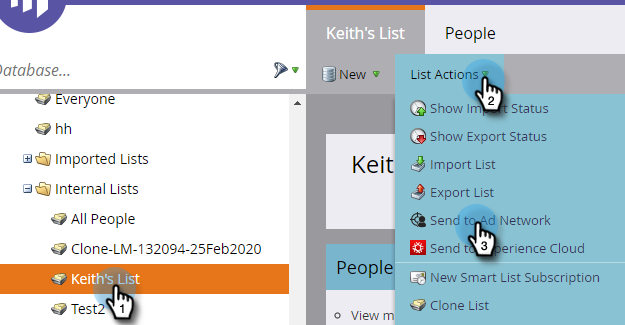

# Inviare un elenco a un ad network {#send-a-list-to-an-ad-network}

Scopri come inviare un elenco statico a [!DNL LinkedIn], [!DNL Facebook] o Google.

## Come inviare un elenco {#how-to-send-a-list}

1. In Marketo, selezionare l&#39;elenco, fare clic sul menu a discesa **[!UICONTROL List Actions]** e selezionare **[!UICONTROL Send to Ad Network]**.

   

1. Scegli tra [!DNL LinkedIn], [!DNL Facebook] o Google (le altre opzioni non sono al momento disponibili). In questo esempio, stiamo scegliendo **[!DNL LinkedIn]**. Fai clic su **[!UICONTROL Next]**.

   

1. Fai clic sul menu a discesa **[!UICONTROL Audience]** e seleziona il pubblico desiderato.

   

   >[!TIP]
   >
   >Se hai bisogno di controllare, puoi vedere il pubblico di destinazione in cui viene sincronizzato un elenco tramite la scheda Stato.

1. Scegliere il [!UICONTROL Push Type] desiderato e fare clic su **[!UICONTROL Update]**.

   

   >[!NOTE]
   >
   >Se selezioni &quot;[!UICONTROL Enable continuous audience sync]&quot;, Marketo mantiene l&#39;elenco aggiornato nella rete di annunci scelta mentre l&#39;elenco cambia nell&#39;istanza di Marketo. Aggiungiamo entrambi **e** persone rimosse dal pubblico se vengono aggiunte o rimosse dall&#39;elenco statico.

1. Ed è tutto! Fare clic su **[!UICONTROL OK]** per uscire.

   

## Domande frequenti {#faq}

**È possibile sincronizzare un singolo elenco statico con più tipi di pubblico di annunci?**

No, un elenco può essere sincronizzato solo con un singolo pubblico di destinazione.

**Se si abilita la sincronizzazione continua con un pubblico di annunci esistente, verrà sostituito il pubblico esistente?**

No, il pubblico esistente verrà aggiunto a, non sostituito.
