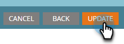

# Inviare un elenco a Google {#send-a-list-to-google}

Per coloro che utilizzano Google Customer Match, segui i passaggi seguenti per inviare un elenco statico di Marketo Engage al tuo account Google.

1. In Marketo Engage, individuate e selezionate l&#39;elenco desiderato.

   

1. Fai clic su **Azioni elenco** a discesa e selezionare **Invia ad Ad Network**.

   

1. Scegli Google e fai clic su **Successivo**.

   

1. Scegli l’account dell’annuncio desiderato. Puoi scegliere un pubblico esistente o crearne uno nuovo. In questo esempio ne stiamo creando uno nuovo. Assegna un nome al nuovo pubblico.

   

1. Effettua selezioni facoltative.

   

   >[!NOTE]
   >
   >* Selezione **Mantieni l’iscrizione al pubblico sincronizzata** mantiene l’elenco aggiornato man mano che cambia nell’istanza. Aggiungiamo/rimuoviamo persone dal pubblico quando vengono aggiunte/rimosse dall’elenco statico.
   >
   >* Selezionando la casella di controllo in basso, si invia lo stato di consenso come CONCESSO per i dati utente inviati a Google Ads a scopo pubblicitario e di personalizzazione degli annunci. Se questa opzione non è selezionata, lo stato del consenso viene inviato come NON SPECIFICATO. Per coloro che intendono caricare dati per gli utenti nello Spazio economico europeo (SEE), Google ha stilato un elenco di [Domande frequenti](https://support.google.com/google-ads/answer/14310715){target="_blank"}, as well as additional details outlining the [EU user consent policy](https://www.google.com/about/company/user-consent-policy/){target="_blank"}.

1. Clic **Aggiorna**.

   

1. Clic **OK** per uscire.

   
