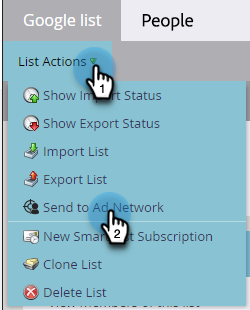
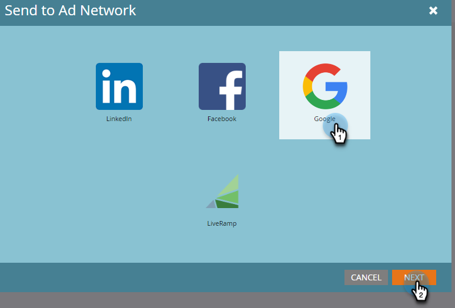
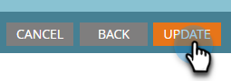
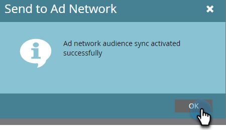

# Inviare un elenco a Google {#send-a-list-to-google}

Per coloro che utilizzano Google Customer Match, segui i passaggi seguenti per inviare un elenco statico di Marketo Engage al tuo account Google.

1. In Marketo Engage, individua e seleziona l’elenco desiderato.

   

1. Fai clic sul menu a discesa **Azioni elenco** e seleziona **Invia ad Ad Network**.

   

1. Scegli Google e fai clic su **Avanti**.

   

1. Scegli l’account dell’annuncio desiderato. Puoi scegliere un pubblico esistente o crearne uno nuovo. In questo esempio ne stiamo creando uno nuovo. Assegna un nome al nuovo pubblico.

   

1. Effettua selezioni facoltative.

   

   >[!NOTE]
   >
   >* Selezionando **Mantieni l&#39;iscrizione al pubblico sincronizzato**, l&#39;elenco viene aggiornato man mano che cambia nell&#39;istanza. L’iscrizione al pubblico viene aggiornata quando le persone vengono aggiunte o rimosse dall’elenco statico.
   >
   >* Selezionando la casella di controllo in basso, si invia lo stato di consenso come CONCESSO per i dati utente inviati a Google Ads a scopo pubblicitario e di personalizzazione degli annunci. Se questa opzione non è selezionata, lo stato del consenso viene inviato come NON SPECIFICATO. Per coloro che prevedono di caricare dati per gli utenti dello Spazio economico europeo (SEE), Google ha stilato un elenco di [domande frequenti](https://support.google.com/google-ads/answer/14310715){target="_blank"} e ulteriori dettagli che descrivono i [criteri di consenso degli utenti dell&#39;UE](https://www.google.com/about/company/user-consent-policy/){target="_blank"}.

1. Fai clic su **Aggiorna**.

   

1. Fare clic su **OK** per uscire.

   
