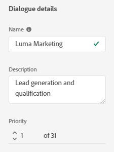

# Criteri di audience {#audience-criteria}

Analogamente agli elenchi avanzati di Marketo, gli attributi dei criteri di pubblico consentono di definire il pubblico di destinazione. Puoi eseguire il targeting di persone note o sconosciute utilizzando gli attributi dedotti, persona o azienda (o una combinazione di questi).

## Priorità {#priority}

La priorità determina quale finestra di dialogo riceve un lead nel caso in cui sia idoneo per più di una. Viene stabilito quando si inizia [creare la finestra di dialogo](/help/marketo/product-docs/demand-generation/dynamic-chat/dialogues/create-a-dialogue.md){target="_blank"}. Per modificare la priorità di una finestra di dialogo esistente, aprila e vai a **Dettagli finestra di dialogo** nella scheda Criteri del pubblico.

## Eventi {#events}

Gli eventi consentono di indirizzare i visitatori in base al numero di scorrimento o alla durata della loro presenza sulla pagina/sito. Nell’esempio seguente, eseguiamo il targeting dei visitatori che si trovano su una pagina specifica da più di 20 secondi.

1. Acquisisci **Tempo sulla pagina** e trascinarlo a destra.

   

1. Impostare il tempo &quot;Maggiore di&quot; su 20 secondi.

   

1. Aggiungi l’URL della pagina desiderata in [Target](#target) sezione.

   

## Attributi {#attributes}

**Persone note**

Ci sono _molti_ combinazioni di attributi tra cui scegliere. Nell’esempio seguente, eseguiamo il targeting di tutti **persone note** in California che lavorano in un&#39;azienda con più di 50 dipendenti.

1. Acquisisci **Stato della persona** e trascinarlo verso destra.

   

1. _È_ è impostato per impostazione predefinita. Nel campo Seleziona valori, digita in CA (puoi anche fare clic sull’elenco a discesa e selezionare dall’elenco).

   

1. Acquisisci **Dimensioni società** e trascinarlo nel punto in cui è indicato _trascina e rilascia qui un attributo_.

   

   >[!NOTE]
   >
   >È inoltre possibile scegliere un attributo facendo clic sul relativo **+** icona.

1. Fai clic sul menu a discesa operatore e seleziona **Maggiore di**.

   

1. Digitare 50 e fare clic in un altro punto dello schermo per salvare.

   

Ed è tutto!

**Persone anonime**

Esiste un modo semplice per eseguire il targeting specifico delle persone che non sono ancora presenti nel database. In questo esempio, eseguiamo il targeting di tutti **persone anonime** si trova nella zona di New York.

1. Acquisisci **E-mail della persona** e trascinarlo verso destra.

   

1. Fai clic sul menu a discesa operatore e seleziona **È vuoto**.

   

1. Acquisisci **Stato dedotto** e trascinarlo nel punto in cui è indicato _trascina e rilascia qui un attributo_.

   

   >[!NOTE]
   >
   >Quando qualcuno visita il tuo sito web, [Munchkin](/help/marketo/product-docs/administration/additional-integrations/add-munchkin-tracking-code-to-your-website.md) li cookie e li inserisce nel sistema. Cerchiamo il loro IP in un database speciale e deduciamo tutti i tipi di buone informazioni.

1. _È_ è impostato per impostazione predefinita. Nel campo Seleziona valori, digita in NY (puoi anche fare clic sull’elenco a discesa e selezionare dall’elenco).

   

## Iscrizione {#membership}

Utilizza gli elenchi avanzati di Marketo Engage per il pubblico di destinazione della finestra di dialogo.

1. In Iscrizione, accedi **Membro di elenco avanzato** e lo rilasci sull&#39;area di lavoro.

   

1. Selezionare l&#39;elenco avanzato desiderato.

   

## Aggiungi gruppi {#add-groups}

Puoi anche raggruppare gli attributi, se desideri che siano tutti determinati attributi insieme a &quot;tutti o uno qualsiasi&quot; di altri. Puoi aggiungere più gruppi.

## Target {#target}

Immettere gli URL in cui si desidera visualizzare una finestra di dialogo specifica. Puoi anche aggiungere esclusioni.

Formati accettabili:

* `http://website.com`
* `https://*.website.com`
* `http://website.com/folder/*`
* `https://*.website.com/folder/*`

>[!NOTE]
>
>L&#39;utilizzo di un asterisco funge da carattere jolly catch-all. Quindi `https://*.website.com` inserirebbe la finestra di dialogo in ogni pagina del sito, inclusi i sottodomini (ad esempio: `support.website.com`). E `https://website.com/folder/*` inserirebbe la finestra di dialogo in ogni pagina HTML nella cartella successiva (ad esempio, in questo caso diciamo che la cartella è &quot;sport&quot;, quindi: website.com/sports/baseball.html, website.com/sports/football.html, ecc.).

**Esclusioni**

Utilizza le esclusioni per assicurarti che la finestra di dialogo **non** in una pagina o area specifica del sito. Le esclusioni seguono lo stesso formato delle inclusioni.

>[!MORELIKETHIS]
>
>* [Creare una finestra di dialogo](/help/marketo/product-docs/demand-generation/dynamic-chat/dialogues/create-a-dialogue.md){target="_blank"}
>* [Designer flusso](/help/marketo/product-docs/demand-generation/dynamic-chat/dialogues/stream-designer.md){target="_blank"}
>* [Rapporti](/help/marketo/product-docs/demand-generation/dynamic-chat/dialogues/reports.md){target="_blank"}

