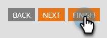

# Impostazioni del flusso conversazionale per Marketi Engage Forms{#conversational-flow-settings-for-marketo-engage-forms}

Rendi conversazionale Forms di Marketo Engage integrandolo con Flussi conversazionali di Dynamic Chat. Qualifica immediatamente i lead utilizzando i dati del modulo o l&#39;iscrizione a elenchi avanzati per prenotazioni di riunioni, collegamenti a white paper o obiettivi personalizzati.

>[!PREREQUISITES]
>
>AGGIUNGI PREREQ QUI

>[!AVAILABILITY]
>
>Il membro di un elenco avanzato o il criterio del membro di un elenco richiede Dynamic Chat Prime. Per ulteriori informazioni, contatta l’Adobe Account Team (il tuo Account Manager).

1. Individuare e selezionare il modulo (o crearne uno nuovo).

   

1. Clic **Modifica bozza**.

   

1. Nella pagina di modifica del modulo, fai clic su **Impostazioni modulo**, quindi **Impostazioni**.

   

1. Fai clic su **Impostazioni del flusso conversazionale** cursore per l&#39;attivazione.

   

1. Verrà visualizzata una finestra modale di scelta predefinita. Seleziona la preferenza. In questo esempio stiamo scegliendo **Usa flusso conversazionale**.

   

1. Seleziona il flusso conversazionale e il tipo di consegna desiderati.

   

   >[!NOTE]
   >
   >[Ulteriori informazioni sui flussi conversazionali](/help/marketo/product-docs/demand-generation/dynamic-chat-two/automated-chat/conversational-flows-overview.md){target="_blank"}

   **PASSAGGIO FACOLTATIVO**: puoi fare clic su Aggiungi scelta per rivolgerti ai visitatori della chat che soddisfano un criterio specifico.

   

   >[!IMPORTANT]
   >
   >Il browser del visitatore deve essere utilizzato come cookie come persona nota prima dell’invio del modulo per essere idoneo a essere membro di Static/Smart List.

1. Clic **Fine** al termine.

   
