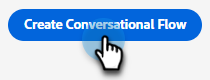

# Creare un flusso conversazionale {#create-a-conversational-flow}

Ecco come creare un nuovo flusso conversazionale.

1. In Chat automatizzata, fai clic su **Flussi conversazionali**.

   

1. Clic **Crea flusso conversazionale**.

   

1. Scegli un flusso conversazionale vuoto o uno dei modelli precompilati. Immetti un nome (la descrizione è facoltativa), cambia la lingua (facoltativo) e fai clic su **Crea**.

   

>[!NOTE]
>
>Questo cambierà solo la lingua del testo di sistema. Sei responsabile della traduzione dei contenuti.

1. Proprio come in Dialoghi, a questo punto è il momento di [creare un flusso](/help/marketo/product-docs/demand-generation/dynamic-chat/dialogues/stream-designer.md#create-a-stream){target="_blank"}.

>[!MORELIKETHIS]
>
>[Panoramica di Conversational Forms](/help/marketo/product-docs/demand-generation/dynamic-chat-two/automated-chat/conversational-flow-overview.md){target="_blank"}
