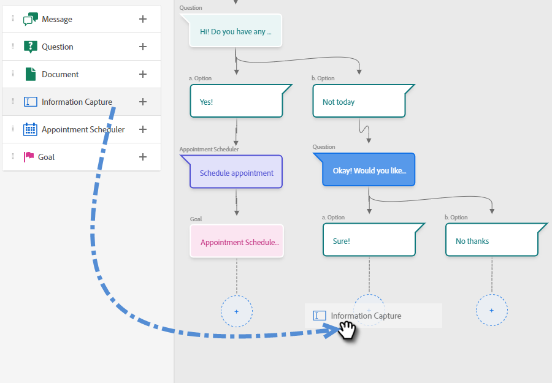
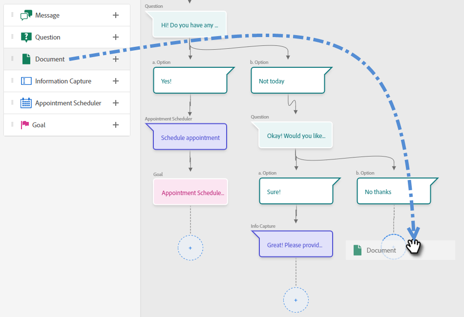

# Designer flusso {#stream-designer}

Ci sono _molti_ combinazioni di flusso possibili. Questo articolo contiene un esempio in cui l’addetto al marketing chiede al visitatore del sito se ha domande sul prodotto. In caso affermativo, il visitatore può pianificare un appuntamento. In caso negativo, il visitatore ha la possibilità di iscriversi a una mailing list per la corrispondenza futura. Viene anche offerto loro un PDF gratuito. L’obiettivo finale è pianificare un appuntamento o raccogliere l’e-mail del visitatore.

>[!PREREQUISITES]
>
>Prima di poter utilizzare la scheda Documento, è necessario [configurarlo](/help/marketo/product-docs/demand-generation/dynamic-chat/integrations/using-the-document-card.md){target="_blank"} nel tuo account di Adobe.

## Schede di Stream Designer {#stream-designer-cards}

Lo stream designer contiene più schede che è possibile aggiungere per modellare la conversazione in chat.

<table>
 <tr>
  <td><strong>Messaggio</strong></td>
  <td>Da utilizzare quando si desidera effettuare una dichiarazione senza bisogno di risposta (ad esempio: "Ciao! Tutti gli articoli hanno il 25% di sconto oggi con il codice SAVE25").
</td>
 </tr>
 <tr>
  <td><strong>Domanda</strong></td>
  <td>Da utilizzare quando si desidera porre una domanda a scelta multipla, di cui si forniscono le risposte disponibili (ad esempio: Quale tipo di veicolo si è interessati? Risposte = SUV, Compatto, Camion, ecc.).</td>
 </tr>
 <tr>
  <td><strong>Documento</strong></td>
  <td>Consente di incorporare documenti PDF nelle finestre di dialogo e di tenere traccia dell’attività di coinvolgimento dei visitatori nei documenti (quante pagine sono state visualizzate, se il documento è stato scaricato e/o qualsiasi termine di ricerca utilizzato).</td>
 </tr>
 <tr>
  <td><strong>Acquisizione delle informazioni</strong></td>
  <td>Utilizzare quando si desidera raccogliere informazioni. I tre campi tra cui scegliere sono Indirizzo e-mail, Numero di telefono e Testo (che consente al visitatore di scrivere il proprio messaggio).</td>
 </tr>
 <tr>
  <td><strong>Modulo di programmazione appuntamenti</strong></td>
  <td>Fornisce al visitatore un calendario delle date disponibili per pianificare un follow-up. La disponibilità del calendario riflette <a href="/help/marketo/product-docs/demand-generation/dynamic-chat/dynamic-chat-overview.md#routing">il prossimo agente in linea</a>.</td>
 </tr>
 <tr>
  <td><strong>Obiettivo</strong></td>
  <td>Questa è l'unica carta che i visitatori non vedranno. Sta a te determinare a quale punto un obiettivo viene raggiunto all’interno della chat specifica (ad esempio, se l’obiettivo è la raccolta dell’e-mail del visitatore, inserisci la scheda Obiettivo immediatamente dopo Info Capture nel flusso).</td>
 </tr>
 <tr>
  <td><strong>Azione</strong></td>
  <td>Simile ai campi nascosti di un modulo, con la scheda delle azioni è possibile popolare qualsiasi attributo del lead o dell’azienda con valori impliciti che si desidera acquisire in base a un record del lead. Puoi aggiungere la scheda delle azioni in qualsiasi punto della conversazione e aggiornare i rispettivi attributi con un valore o token nativi che popolano automaticamente il rispettivo valore.</td>
 </tr>
 <tr>
  <td><strong>Chat in tempo reale</strong></td>
  <td>Utilizza la scheda chat in diretta quando desideri che i visitatori chattino con un agente in diretta.
  <li>La scheda chat live deve essere l'ultima scheda del ramo.</li>
  <li>I visitatori verranno indirizzati a un agente non appena raggiungono questa scheda nel flusso, pertanto si consiglia di anteporre a questa scheda una scheda con le domande che chiedono ai visitatori se desiderano chattare con un agente live.</li></td>
 </tr>
</table>

## Icone di Stream Designer {#stream-designer-icons}

In alto a destra in Progettazione flussi sono visualizzate alcune icone. Ecco cosa fanno.

<table>
 <tr>
  <td></td>
  <td>Aggiunge una griglia allo sfondo per coloro che preferiscono tale visualizzazione</td>
 </tr>
 <tr>
  <td></td>
  <td>Ingrandisce, creando schede più grandi</td>
 </tr>
 <tr>
  <td></td>
  <td>Esegue lo zoom indietro, creando schede più piccole</td>
 </tr>
 <tr>
  <td></td>
  <td>Apre una finestra per il test della chat (premere lo stesso pulsante per chiudere)</td>
 </tr>
 <tr>
  <td></td>
  <td>Dispone tutte le schede nel flusso</td>
 </tr>
</table>

## Creare un flusso {#create-a-stream}

1. Dopo aver [ha creato la tua finestra di dialogo](/help/marketo/product-docs/demand-generation/dynamic-chat/dialogues/create-a-dialogue.md){target="_blank"}, fare clic su **Progettazione flussi** scheda.

   

1. Trascinare e rilasciare la scheda Domanda.

   

1. In Risposta chatbot, scrivi la tua domanda come vorresti.

   

   >[!TIP]
   >
   >Puoi personalizzare l’esperienza per i visitatori della chat conosciuti utilizzando dei token (es: Hello `{{lead.leadFirstName:""}}`). Fai clic sull’icona della parentesi graffa a destra ed effettua la selezione. Aggiungi un valore predefinito tra i quoate se vuoi che i visitatori anonimi vedano qualcosa di generico (es: Hello `{{lead.leadFirstName:"there"}}`).

   >[!NOTE]
   >
   >Poke è impostato su on per impostazione predefinita, il che mostra la domanda di apertura accanto all’icona della chat senza che il visitatore debba fare clic su di essa per visualizzarla. Poke è disponibile solo sulla prima scheda della conversazione.

1. Inserisci le risposte utente e fai clic su **Salva**.

   

   >[!NOTE]
   >
   >**Modifica valori memorizzati** è un passaggio facoltativo per coloro che desiderano memorizzare nel database un valore diverso da quello visualizzato ai visitatori nel chatbot per gli attributi mappati nella scheda Domanda (ad esempio, il visitatore vede &quot;Ottimizzazione del motore di ricerca&quot; e il valore viene memorizzato come &quot;SEO&quot;).

1. Se si seleziona &quot;Sì&quot; si desidera pianificare un appuntamento, quindi trascinare l&#39;opzione nella scheda Programmazione appuntamenti.

   

1. Nella colonna a destra, fai clic su **Salva**.

   

1. Poiché si tratta di un obiettivo, trascinare la scheda Obiettivo sotto lo scheduler appuntamenti.

   

1. Assegna un nome all’obiettivo (o scegliine uno esistente) e fai clic su **Salva**.

   

1. Per &quot;No&quot; vogliamo vedere se si uniranno alla mailing list, quindi sotto quell&#39;opzione trascina su un&#39;altra scheda Domanda.

   

1. Inserisci la risposta e aggiungi le scelte di risposta per il visitatore. Clic **Salva** al termine.

   

   >[!NOTE]
   >
   >Puoi aggiungere altre risposte facendo clic su **Aggiungi risposta**.

1. Sotto la risposta &quot;Sì&quot;, trascina sulla scheda Info Capture per raccogliere l’e-mail del visitatore.

   

1. Fai clic su **Tipo** a discesa e selezionare **E-mail**.

   

1. Inserisci un messaggio chatbot e un segnaposto. Assicurati che l’attributo sia mappato al campo appropriato in Marketo e fai clic su **Salva**.

   

   <table>
    <tr>
     <td><strong>Tipo</strong></td>
     <td>Tipo di informazioni da acquisire: telefono, testo, e-mail.</td>
    </tr>
    <tr>
     <td><strong>Messaggio del chatbot</strong></td>
     <td>Il messaggio visualizzato dal visitatore che gli chiede di fornire le informazioni.</td>
    </tr>
    <tr>
     <td><strong>Placeholder</strong></td>
     <td>Testo di esempio che aiuta il visitatore a vedere cosa inserire.</td>
    </tr>
    <tr>
     <td><strong>Mappa risposta su attributo</strong></td>
     <td>Consente di sincronizzare la risposta del visitatore al campo corrispondente nel record Persona nell’abbonamento Marketo.</td>
    </tr>
   </table>

1. Poiché la raccolta dell’e-mail è un obiettivo, trascina la scheda Obiettivo sotto Acquisizione informazioni.

   

1. Assegna un nome all’obiettivo (o scegliine uno esistente) e fai clic su **Salva**.

   

1. Ricordati di aggiungere una risposta se dicono &quot;No&quot;. Un&#39;opzione consiste nel trascinare una scheda Messaggio qui sotto e dire &quot;grazie comunque&quot;. In questo esempio, forniremo loro invece un documento di PDF gratuito.

   

1. In questo esempio verrà creato un nuovo documento. Assegna un nome, immetti l’URL del PDF che hai già ospitato e fai clic su **Salva**.

   

1. Seleziona la **Anteprima** attiva per visualizzare l’anteprima della finestra di dialogo.

   

1. Quando sei pronto ad attivare la tua finestra di dialogo, fai clic su **Pubblica**.

   

>[!NOTE]
>
>Prima di fare clic su Pubblica, ricordati di verificare di aver [ha inserito gli URL di destinazione](/help/marketo/product-docs/demand-generation/dynamic-chat/dialogues/audience-criteria.md#target){target="_blank"}.

>[!MORELIKETHIS]
>
>* [Creare una finestra di dialogo](/help/marketo/product-docs/demand-generation/dynamic-chat/dialogues/create-a-dialogue.md){target="_blank"}
>* [Criteri di audience](/help/marketo/product-docs/demand-generation/dynamic-chat/dialogues/audience-criteria.md){target="_blank"}
>* [Rapporti](/help/marketo/product-docs/demand-generation/dynamic-chat/dialogues/reports.md){target="_blank"}
>* [Utilizzo della scheda documento](/help/marketo/product-docs/demand-generation/dynamic-chat/integrations/using-the-document-card.md){target="_blank"}

