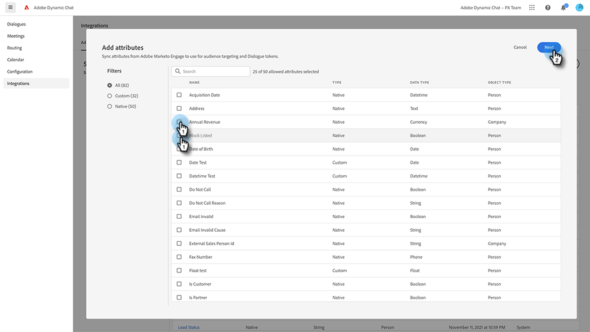

# Adobe Marketo Engage {#adobe-marketo-engage}

## Dynamic Chat di connessione {#connecting-dynamic-chat}

Dopo aver completato la [configurazione iniziale](/help/marketo/product-docs/demand-generation/dynamic-chat/initial-setup.md){target="_blank"}, è ora di eseguire il Dynamic Chat di connessione per la sincronizzazione una tantum con la sottoscrizione a Marketo.

1. In Il mio Marketo, fai clic su **Dynamic Chat** affiancare.

   

   >[!NOTE]
   >
   >Se non vedi il riquadro, rivolgiti al tuo amministratore Marketo.

1. Se in precedenza hai effettuato l’accesso a un’applicazione con un Adobe ID, verrai portato direttamente al Dynamic Chat. In caso contrario, [configurare l’Adobe ID](https://helpx.adobe.com/manage-account/using/create-update-adobe-id.html){target="_blank"}.

1. Per collegare la tua istanza di Marketo, seleziona **Integrazioni**.

   

1. Nella scheda Marketo, fai clic su **Avvia sincronizzazione**.

   

1. Seleziona fino a 50 attributi (campi standard o personalizzati) dalla tua istanza di Marketo per sincronizzarli con il Dynamic Chat e utilizzarli nel targeting del pubblico, nella mappatura dei dati e nella personalizzazione. Clic **Successivo** al termine.

   

1. Controllare le selezioni. Clic **Conferma** per avviare la sincronizzazione.

   

>[!NOTE]
>
>Il completamento della sincronizzazione può richiedere da 2 a 24 ore, a seconda delle dimensioni del database.

## Aggiungi un attributo {#add-an-attribute}

Dopo la sincronizzazione iniziale, ecco come aggiungere attributi aggiuntivi.

1. In entrata **Integrazioni**, assicurarsi che **Adobe Marketo Engage** è selezionata e fai clic su **Aggiungi attributo**.

   

1. Seleziona gli attributi da aggiungere e fai clic su **Successivo**.

   

1. Verifica le selezioni e fai clic su **Conferma**.

   

## Rimuovere un attributo {#remove-an-attribute}

Dopo la sincronizzazione iniziale, ecco come rimuovere un attributo.

>[!NOTE]
>
>L&#39;opzione per rimuovere un attributo è disponibile solo se non è attualmente utilizzato da finestre di dialogo.

1. In entrata **Integrazioni**, assicurarsi che **Adobe Marketo Engage** e fare clic sull&#39;attributo che si desidera rimuovere.

   

1. Clic **Rimuovi attributo**.

   

>[!MORELIKETHIS]
>
>[Configurazione iniziale](/help/marketo/product-docs/demand-generation/dynamic-chat/initial-setup.md){target="_blank"}

