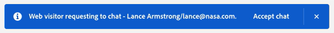

# Casella in entrata agente {#agent-inbox}

Gli agenti inseriranno le chat live nella casella in entrata dell’agente. Oltre alle conversazioni attive, possono visualizzare le conversazioni passate, le informazioni sui visitatori e altro ancora.

## Attiva/Disattiva disponibilità {#availability-toggle}

Nella parte superiore destra della schermata Casella in entrata agente è possibile impostare lo stato come disponibile o non disponibile.

>[!IMPORTANT]
>
>**Questo sostituirà** il [disponibilità live chat](/help/marketo/product-docs/demand-generation/dynamic-chat-two/setup-and-configuration/agent-settings.md#live-chat-availability) è stato stabilito in Impostazioni agente. Lo stato rimarrà fino al ripristino o al successivo blocco di tempo della disponibilità.

## Accettazione di una chat in diretta {#accepting-a-live-chat}

Quando una chat in diretta viene indirizzata all&#39;agente, vede un banner blu nella parte superiore dello schermo che chiede di accettare.

### Aspetti da considerare {#things-to-note}

* Gli agenti hanno 45 secondi di tempo per rispondere prima che venga visualizzato il messaggio &quot;Accept chat&quot; (Accetta chat).
* SUGGERIMENTO BROWSER
* Al momento esiste un limite di 10 chat live per agente

## Conversazioni {#conversations}

Sul lato sinistro della schermata Casella in entrata agente è possibile scegliere di visualizzare solo le conversazioni attive o tutte.

## Informazioni visitatore {#visitor-information}

Sul lato destro della schermata Casella in entrata agente, potrai vedere (dall&#39;alto in basso) il nome, la qualifica, l&#39;indirizzo e-mail, il numero di telefono e lo stato del sistema di gestione delle relazioni con i clienti. Tutte le informazioni non trasmesse vengono visualizzate come un trattino (-).

## Cronologia attività {#activity-history}

Sotto le informazioni sul visitatore si trova la cronologia delle attività. Visualizza i tipi di attività e le date, e anche le trascrizioni delle chat.

>[!NOTE]
>
>Le informazioni vengono visualizzate solo per gli ultimi 90 giorni.

Conversazioni attive- Tutte le conversazioni- Condivisione calendario Informazioni visitatore- Attività di Dynamic Chat recenti
