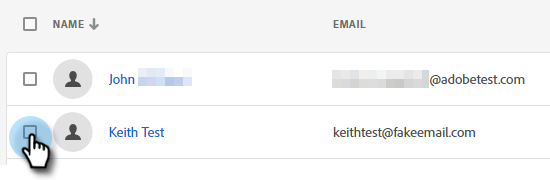

# Aggiungi o rimuovi utenti chat {#add-or-remove-chat-users}

Per aggiungere o rimuovere utenti chat, segui la procedura riportata di seguito.

## Aggiungi un utente di chat {#add-a-chat-user}

1. Accedi a [Adobe Admin Console](https://adminconsole.adobe.com/).

   

1. Clic **Dynamic Chat**.

   

   >[!NOTE]
   >
   >Se disponi di più di un abbonamento a Marketo, seleziona quello desiderato prima del passaggio successivo.

1. Fai clic su **Utenti** scheda.

   

1. Fai clic su **Aggiungi utente** pulsante.

   

1. Immetti il nome, il gruppo di utenti o l’indirizzo e-mail dell’utente che desideri aggiungere. Nome e cognome sono facoltativi.

   

1. Fai clic su **+** e seleziona il profilo di prodotto desiderato.

   

1. Clic **Salva**.

   

## Aggiungi accesso Dynamic Chat al ruolo Marketo {#add-dynamic-chat-access-to-marketo-role}

Se il ruolo Marketo dell&#39;utente di Chat appena aggiunto non dispone dell&#39;autorizzazione di Dynamic Chat, fare clic qui per aggiungerlo.

1. In Marketo, fai clic su **Amministratore** e seleziona **Utenti e ruoli**.

   

1. Fai clic su **Ruoli** scheda.

   

1. Dall’elenco, seleziona il ruolo da modificare e fai clic su **Modifica Ruolo**.

   

1. Seleziona **Dynamic Chat di accesso** e fai clic su **Salva**.

   

## Rimuovere un utente di chat {#remove-a-chat-user}

1. Accedi a [Adobe Admin Console](https://adminconsole.adobe.com/).

   

1. Clic **Dynamic Chat**.

   

   >[!NOTE]
   >
   >Se disponi di più di un abbonamento a Marketo, seleziona quello desiderato prima del passaggio successivo.

1. Fai clic su **Utenti** scheda.

   

1. Selezionare l&#39;utente che si desidera rimuovere.

   

1. Fai clic su **Rimuovi utente** pulsante.

   

1. Clic **Rimuovi utente** per confermare.

   

>[!MORELIKETHIS]
>
>* [Utenti Adobe Admin Console](https://helpx.adobe.com/enterprise/using/users.html)
>* [Gestisci Singolarmente Gli Utenti](https://helpx.adobe.com/enterprise/using/manage-users-individually.html)
