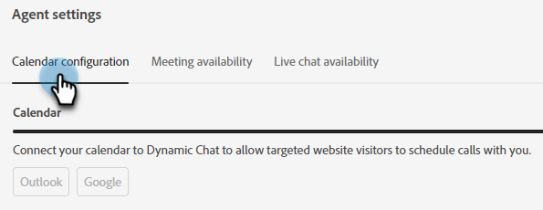

# Impostazioni agente {#agent-settings}

Configura il calendario e imposta la disponibilità di riunioni/chat live.

## Connetti calendario {#connect-calendar}

Nella scheda Configurazione calendario connettere il calendario di Outlook o Gmail per la pianificazione degli appuntamenti nel chatbot.

Una volta connesso al Dynamic Chat, il calendario di un utente verrà aggiunto alla coda e sarà disponibile per consentire ai visitatori del sito Web di pianificare gli appuntamenti in data.

>[!NOTE]
>
>È possibile connettere un calendario per utente. Se si desidera ricevere riunioni su più calendari, è necessario aggiungere più utenti e fare in modo che ciascuno di essi connetta i propri calendari.

Gli utenti possono inoltre personalizzare il corpo dell’invito inviato al visitatore quando pianificano un appuntamento nel calendario dell’utente. Possono anche selezionare la casella di controllo in basso per includere un Google Meeting o un collegamento ai Microsoft Teams (a seconda del calendario connesso).

>[!TIP]
>
>Utilizza l’icona del token (parentesi graffe) per personalizzare le e-mail di conferma della prenotazione della riunione utilizzando gli attributi della persona o dell’azienda.

### Autorizzazioni {#permissions}

La configurazione con Outlook concede le seguenti autorizzazioni al Dynamic Chat:

* Accesso completo ai calendari
* Accedi e leggi il tuo profilo
* Gestisci accesso ai dati a cui hai dato accesso
* Leggi le impostazioni della cassetta postale

La configurazione con Google concede le seguenti autorizzazioni al Dynamic Chat:

* Creare, modificare o eliminare calendari
* Aggiornare singoli eventi di calendario
* Modifica le impostazioni, compreso chi può visualizzare gli eventi
* Modifica l&#39;utente con cui è condiviso il calendario
* Accesso a nome, indirizzo e-mail, preferenza della lingua e immagine del profilo

## Disponibilità prenotazione riunione {#meeting-booking-availability}

Impostare il fuso orario e l&#39;ora/giorno della settimana per ricevere le prenotazioni per le riunioni.

<table> 
 <tbody> 
  <tr> 
   <td><b>Durata riunione</b></td>
   <td>Determina il periodo di tempo che i visitatori visualizzeranno negli spazi riunioni disponibili.</td>
  </tr> 
  <tr> 
   <td><b>Tempo di buffer tra riunioni</b></td>
   <td>Quantità di tempo impostata come buffer per dopo la riunione. Se si imposta la durata di 30 minuti, nessuno potrà prenotare una riunione con l'utente fino a 30 minuti dopo la fine pianificata di una riunione nel calendario.</td>
  </tr>
 </tbody> 
</table>

>[!TIP]
>
>Puoi selezionare più blocchi di tempo nello stesso giorno (ad esempio, venerdì da 8a-12p _e_ 1p-5p) facendo clic sul pulsante **+** accedi a destra.

## Disponibilità chat in tempo reale {#live-chat-availability}

Imposta il tuo fuso orario e l’ora/giorno della settimana per ricevere le chat in diretta.

Se hai effettuato l’accesso all’app, riceverai una notifica in-app di una chat in arrivo. Se non hai effettuato l&#39;accesso, riceverai una notifica dal browser (se hai [configuralo](/help/marketo/product-docs/demand-generation/dynamic-chat-two/live-chat/agent-inbox.md#live-chat-notifications){target="_blank"}).

>[!IMPORTANT]
>
>Il [attivazione/disattivazione della disponibilità](/help/marketo/product-docs/demand-generation/dynamic-chat-two/live-chat/agent-inbox.md#availability-toggle){target="_blank"} nella casella in entrata dell’agente **sostituirà** nella scheda Disponibilità chat in diretta. Pertanto, se si è programmati come disponibili a partire da 1p-5p, ma si deve fare una breve pausa a 3p, non è necessario modificare le impostazioni dell&#39;agente. Lo stato di attivazione/disattivazione della disponibilità rimarrà fino alla modifica manuale o al raggiungimento del blocco di tempo successivo nella disponibilità.

>[!TIP]
>
>Puoi selezionare più blocchi di tempo nello stesso giorno (ad esempio, venerdì da 8a-12p _e_ 1p-5p) facendo clic sul pulsante **+** accedi a destra.
