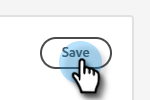

# Configurazione {#configuration}

Scopri come personalizzare l’aspetto della finestra di dialogo del chatbot.

Per iniziare, fai clic su **Configurazione**.

Sono disponibili diverse opzioni di personalizzazione.

## Scheda Stile {#style-tab}

### Stile {#style}

Qui puoi definire l’aspetto del chatbot in cui verranno visualizzate le finestre di dialogo, inclusi: colori, font, posizionamento del widget bot e nome/avatar del chatbot.

Il colore di ogni categoria è determinato da un [valore colore esadecimale](https://color.adobe.com/create/color-wheel) (ad esempio, bianco = #ffffff, rosso = #bf1932, ecc.).

L’ancoraggio consente al visitatore del sito di aprire/chiudere la chatbox. Puoi scegliere se visualizzare l’icona in basso a destra o in basso a sinistra. Puoi anche aumentare/ridurre la spaziatura interna (la quantità di spazio tra l’icona e la parte inferiore della pagina web).

### Impostazioni agente {#agent-settings}

In Impostazioni agente, puoi aggiungere un’etichetta alla chatbox (ad esempio, &quot;bot Adobe&quot;) che verrà visualizzata nella parte superiore. Puoi anche determinare il ritardo di risposta (in secondi) e modificare l’avatar della chat. Per caricare la tua immagine avatar, fai clic su **+** pulsante.

>[!NOTE]
>
>Gli avatar personalizzati devono essere immagini quadrate inferiori a 256 kb e inferiori a 200x200 px. I tipi di file supportati sono: .jpg, .png, .gif, .webp, .svg.

Al termine, ricorda di fare clic su **Salva**.

## Scheda Privacy {#privacy-tab}

Fai clic su **Privacy** per aggiungere/modificare l’URL dell’informativa sulla privacy del sito (facoltativo).

## Scheda Installazione {#installation-tab}

Per far sì che il chatbot venga visualizzato sul sito web, devi innanzitutto installare lo snippet JavaScript di Dynamic Chat. Fai clic su questa scheda per trovare/copiare il codice necessario. Se non conosci questa operazione, contatta il tuo team Web o il reparto IT per assistenza.

>[!TIP]
>
>Se il sito utilizza un criterio sulla sicurezza dei contenuti, potrebbe essere necessario inserire in una whitelist i seguenti URL affinché il chatbot funzioni come previsto:
>
>* `*.adoberesources.net`
>* `*.adobe.io`
>* `*.typekit.net`

>[!NOTE]
>
>Il supporto Marketo non è configurato per fornire assistenza nella risoluzione dei problemi di HTML. Per assistenza HTML, consulta uno sviluppatore web.
