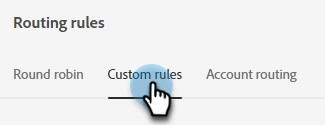

# Indirizzamento {#routing}

Le riunioni prenotate in Dynamic Chat possono essere instradate in due modi. Round robin o utilizzo di una regola personalizzata.

Round robin: le riunioni vengono assegnate agli agenti in sequenza. Quindi se hai cinque agenti e l&#39;agente tre ha preso l&#39;ultima riunione, l&#39;agente quattro prenderà la prossima, seguita dall&#39;agente cinque, e poi di nuovo dall&#39;agente uno.

Regola personalizzata: è possibile scegliere agenti specifici per ricevere riunioni in base agli attributi selezionati.

## Creare una regola personalizzata {#create-a-custom-rule}

In questo esempio invieremo tutte le riunioni dagli stati dedotti di CA, OR e WA all&#39;agente John.

1. In Dynamic Chat, seleziona **Indirizzamento**.

   

1. Fai clic su **Regole personalizzate** scheda.

   

1. Clic **Crea regola**.

   

1. Assegna un nome alla regola e fai clic su **Successivo**.

   

1. Scegli gli agenti desiderati.

   

1. Trascina sull’attributo o sugli attributi desiderati.

   

1. Trova e seleziona i valori desiderati.

   

1. Dopo aver selezionato tutti i valori desiderati, fai clic su **Salva**.

   
