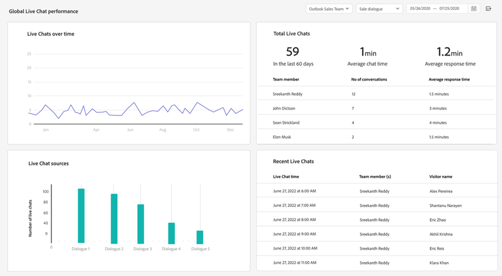

# Analytics {#analytics}

Mentre il reporting è disponibile a livello di finestra di dialogo, controlla il coinvolgimento complessivo utilizzando le tre dashboard seguenti.

Accedi a ogni dashboard in **Analytics** nella barra di navigazione a sinistra.

## Dashboard delle prestazioni globali {#global-performance-dashboard}

Scopri le prestazioni delle finestre di dialogo, tra cui metriche di coinvolgimento e prestazioni (totali e nel tempo), pagine con prestazioni migliori e finestre di dialogo con prestazioni migliori.

Visualizzare finestre di dialogo, flussi conversazionali o tutti. Ordina per visitatori noti, visitatori sconosciuti o entrambi. Seleziona un predefinito o un intervallo di date personalizzato. Esporta i risultati facendo clic su un pulsante.

## Dashboard prestazioni riunione {#meeting-performance-dashboard}

Scopri quante riunioni vengono prenotate e con chi vengono prenotate.

Visualizzare finestre di dialogo, flussi conversazionali o tutti. Seleziona un predefinito o un intervallo di date personalizzato. Esporta i risultati facendo clic su un pulsante.

## Dashboard delle prestazioni della chat in diretta {#live-chat-performance-dashboard}

Visualizza quante conversazioni hanno avuto i tuoi agenti di vendita dal vivo e quali team stanno ottenendo i migliori risultati.

Visualizzare finestre di dialogo, flussi conversazionali o tutti. Seleziona un predefinito o un intervallo di date personalizzato. Esporta i risultati con un clic.

## Definizioni {#definitions}

<table>
<thead>
<tbody>
  <tr>
    <td><b>Completato</b></td>
    <td>Un evento completato si verifica quando un visitatore raggiunge l’ultimo prompt di una conversazione <i>o</i> quando un visitatore esaurisce tutti i contenuti di una conversazione.
     Un evento completato per visitatore, per sessione.</td>
  </tr>
  <tr>
    <td><b>Persone acquisite</b></td>
    <td>Si verifica quando un visitatore invia il proprio indirizzo e-mail.
     Un'acquisizione per visitatore, per sessione.</td>
  </tr>
</tbody>
</table>
