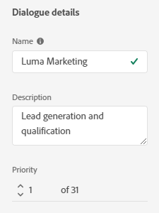
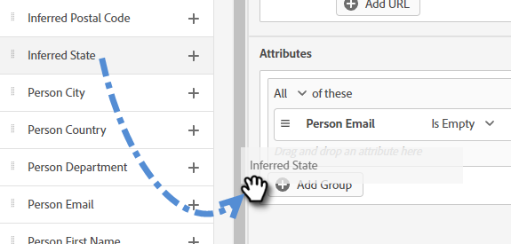

# Criteri di audience {#audience-criteria}

Analogamente agli elenchi avanzati di Marketo Engage, gli attributi dei criteri di pubblico consentono di definire il pubblico di destinazione. Puoi eseguire il targeting di persone note o sconosciute utilizzando gli attributi dedotti, persona o azienda (o una combinazione di questi).

## Priorità {#priority}

La priorità determina quale finestra di dialogo riceve un lead nel caso in cui sia idoneo per più di una. Viene stabilito quando [crei il tuo dialogo](/help/marketo/product-docs/demand-generation/dynamic-chat/automated-chat/create-a-dialogue.md){target="_blank"}. Per modificare la priorità di una finestra di dialogo esistente, aprila e vai a **[!UICONTROL Dialogue Details]** nella scheda Criteri pubblico.

## Eventi {#events}

Gli eventi consentono di indirizzare i visitatori in base al numero di scorrimento o alla durata della loro presenza sulla pagina/sito. Nell’esempio seguente, eseguiamo il targeting dei visitatori che si trovano su una pagina specifica da più di 20 secondi.

1. Acquisisci l&#39;evento **[!UICONTROL Time on Page]** e trascinalo a destra.

   

1. Impostare il tempo &quot;[!UICONTROL Greater Than]&quot; su 20 secondi.

   

1. Aggiungere l&#39;URL della pagina desiderata nella sezione [[!UICONTROL Target]](#target).

   

## Attributi {#attributes}

**Persone note**

Sono disponibili _molte_ combinazioni di attributi tra cui scegliere. Nell’esempio seguente, il targeting riguarda tutte le persone note in California che lavorano in un’azienda con più di 50 dipendenti.

1. Acquisire l&#39;attributo **[!UICONTROL Person State]** e trascinarlo verso destra.

   

1. _[!UICONTROL Is]_&#x200B;è impostato per impostazione predefinita. Nel campo Seleziona valori, digita in CA (puoi anche fare clic sull’elenco a discesa e selezionare dall’elenco).

   

1. Acquisisci l&#39;attributo **[!UICONTROL Company Size]** e trascinalo nella posizione in cui è indicato _trascina un attributo qui_.

   

   >[!NOTE]
   >
   >È inoltre possibile scegliere un attributo facendo clic sulla relativa icona **+**.

1. Fare clic sul menu a discesa operatore e selezionare **[!UICONTROL Greater Than]**.

   

1. Digitare 50 e fare clic in un altro punto dello schermo per salvare.

   

Ed è tutto!

**Persone anonime**

Esiste un modo semplice per eseguire il targeting specifico delle persone che non sono ancora presenti nel database. In questo esempio, il targeting riguarda tutte le persone anonime che si trovano nell&#39;area di New York.

1. Acquisire l&#39;attributo **[!UICONTROL Person Email]** e trascinarlo verso destra.

   

1. Fare clic sul menu a discesa operatore e selezionare **[!UICONTROL Is Empty]**.

   

1. Acquisisci l&#39;attributo **[!UICONTROL Inferred State]** e trascinalo nella posizione in cui è indicato _trascina un attributo qui_.

   

   >[!NOTE]
   >
   >Quando qualcuno visita il tuo sito Web, [Munchkin](/help/marketo/product-docs/administration/additional-integrations/add-munchkin-tracking-code-to-your-website.md){target="_blank"} lo cookie e lo inserisce nel sistema. Cerchiamo il loro IP in un database speciale e deduciamo tutti i tipi di buone informazioni.

1. _[!UICONTROL Is]_&#x200B;è impostato per impostazione predefinita. Nel campo Seleziona valori, digita in NY (puoi anche fare clic sull’elenco a discesa e selezionare dall’elenco).

   

## Iscrizione {#membership}

Utilizza gli elenchi avanzati di Marketo Engage per il pubblico di destinazione della finestra di dialogo.

>[!AVAILABILITY]
>
>Il membro di un elenco avanzato o il criterio Membro di un elenco richiede Dynamic Chat Prime. Per ulteriori informazioni, contatta il team dell’account di Adobe (il tuo Account Manager).

1. In Appartenenza, acquisire **[!UICONTROL Member of Smart List]** e rilasciarlo sull&#39;area di lavoro.

   

1. Selezionare l&#39;elenco avanzato desiderato.

   

## Aggiungi gruppi {#add-groups}

Puoi anche raggruppare gli attributi, se desideri che siano tutti determinati attributi insieme a &quot;tutti o uno qualsiasi&quot; di altri. Puoi aggiungere più gruppi.

## Target {#target}

Immettere gli URL in cui si desidera visualizzare una finestra di dialogo specifica. Puoi anche aggiungere esclusioni.

Formati accettabili:

* `http://website.com`
* `https://*.website.com`
* `http://website.com/folder/*`
* `https://*.website.com/folder/*`

>[!NOTE]
>
>* L&#39;utilizzo di un asterisco funge da carattere jolly catch-all. Pertanto `https://*.website.com` inserirebbe la finestra di dialogo in ogni pagina del sito, inclusi i sottodomini (esempio: `support.website.com`). E `https://website.com/folder/*` inserirebbe la finestra di dialogo in ogni pagina di HTML nella cartella successiva (es: in questo caso diciamo che la cartella è &quot;sport&quot;, quindi: website.com/sports/baseball.html, website.com/sports/football.html, ecc.).
>
>* I parametri URL non sono attualmente supportati.

**Esclusioni**

Utilizza le esclusioni per assicurarti che la finestra di dialogo _non_ venga visualizzata in una pagina o in un&#39;area specifica del sito. Le esclusioni seguono lo stesso formato delle inclusioni.

>[!MORELIKETHIS]
>
>* [Crea un dialogo](/help/marketo/product-docs/demand-generation/dynamic-chat/automated-chat/create-a-dialogue.md){target="_blank"}
>* [Trasmetti Designer](/help/marketo/product-docs/demand-generation/dynamic-chat/automated-chat/stream-designer.md){target="_blank"}
