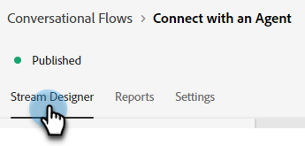
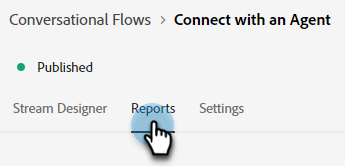
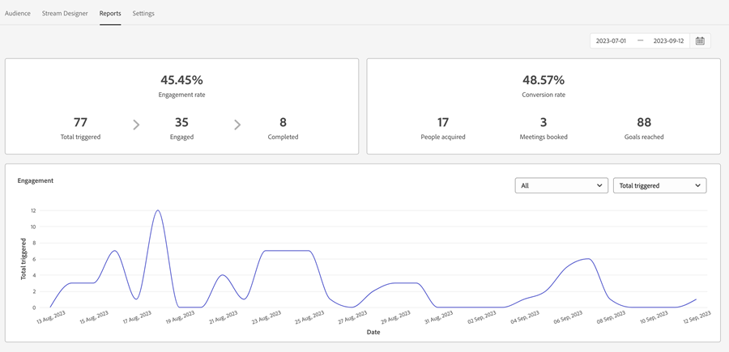
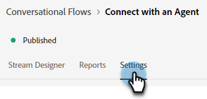
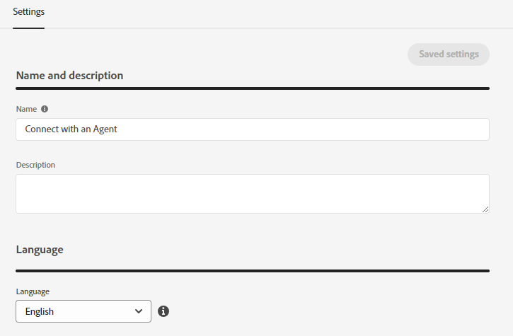
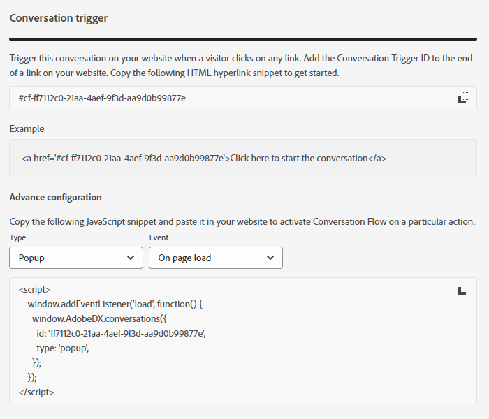

# Panoramica sul flusso conversazionale {#conversational-flow-overview}

Progetta un flusso conversazionale e attivalo per qualsiasi visitatore in base a un’azione specifica (ad esempio, clic su un pulsante call-to-action, al caricamento della pagina, tempo trascorso sulla pagina e così via).

## Finestre di dialogo e flussi conversazionali {#dialogues-vs-conversational-flows}

Le finestre di dialogo e i flussi conversazionali hanno diverse somiglianze, ma sono due funzioni separate.

<table>
 <tbody>
  <tr>
   <th style="width:50%">Dialogo</th>
   <th style="width:50%">Flussi conversazionali</th>
  </tr>
  <tr>
   <td>Le finestre di dialogo sono mirate: puoi progettare una conversazione per una pagina e un pubblico specifici in base ai parametri implementati.</td>
   <td>Vengono attivati i flussi di conversazione: si progetta una conversazione che può essere attivata in base all'azione di un visitatore, ad esempio la compilazione di un modulo, la selezione di un collegamento e così via.</td>
  </tr>
   <tr>
   <td>Supportato solo nell’interfaccia Chatbot.</td>
   <td>Attualmente supportato in un'interfaccia a comparsa, con più interfacce pianificate.</td>
  </tr>
  </tr>
   <tr>
   <td>È possibile creare più finestre di dialogo per lo stesso segmento di lead, con un ordine di priorità in modo che ogni visitatore visualizzi la finestra di dialogo in sequenza in base alla priorità mentre continua a interagire.</td>
   <td>I flussi conversazionali non hanno ordine di priorità e possono essere attivati un numero qualsiasi di volte dallo stesso lead in base al call-to-action determinato.</td>
  </tr>
  <tr>
   <td>Le conversazioni chatbot sono alimentate da Finestre di dialogo.</td>
   <td><a href="/help/marketo/product-docs/demand-generation/dynamic-chat/automated-chat/conversational-flow-settings-for-marketo-engage-forms.md" target="_blank">Forms</a> per conversazioni in Marketo Engage è basato su flussi per conversazioni.</td>
  </tr>
 </tbody>
</table>

## Scheda Streaming Designer {#stream-designer-tab}

Il Designer di flusso per i flussi conversazionali è quasi identico a quello per le finestre di dialogo. [Ulteriori informazioni](/help/marketo/product-docs/demand-generation/dynamic-chat/automated-chat/stream-designer.md){target="_blank"}.

## Scheda Rapporti {#reports-tab}

Nella scheda Rapporti potrai vedere le metriche relative alle prestazioni del flusso conversazionale.

Visualizza il tasso di coinvolgimento, il tasso di conversione, i filtri per visitatori noti e/o sconosciuti e altro ancora.

## Scheda Impostazioni {#settings-tab}

Nella parte superiore della scheda Impostazioni, è possibile aggiornare il nome del flusso conversazionale, aggiungere una descrizione facoltativa e modificare la lingua.

>[!NOTE]
>
>Se si seleziona una lingua diversa, verrà modificata solo la lingua del testo di sistema. Sei responsabile della traduzione dei contenuti.

### SDK per le conversazioni {#conversations-sdk}

Nella parte inferiore della scheda Impostazioni, personalizzare il trigger Conversazione, noto anche come SDK Conversazioni. Puoi decidere se la conversazione viene attivata sul tuo sito web quando un visitatore fa clic su un collegamento o al caricamento della pagina.

>[!TIP]
>
>Visualizza [Conversazioni SDK](https://experienceleague.adobe.com/tools/marketo-dynamic-chatbot/conversations-sdk/){target="_blank"} in azione.

>[!MORELIKETHIS]
>
>[Crea un flusso conversazionale](/help/marketo/product-docs/demand-generation/dynamic-chat/automated-chat/create-a-conversational-flow.md){target="_blank"}
