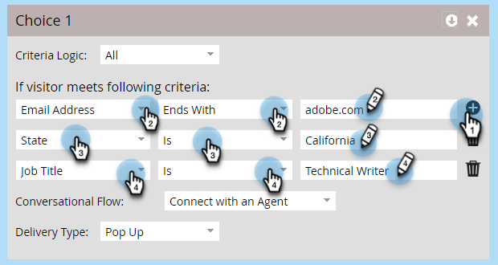

# Impostazioni del flusso conversazionale per Marketo Engage Forms{#conversational-flow-settings-for-marketo-engage-forms}

Rendi conversazionale Forms di Marketo Engage integrandolo con Flussi conversazionali di Dynamic Chat. Qualifica immediatamente i lead utilizzando i dati del modulo o l&#39;iscrizione a elenchi avanzati per prenotazioni di riunioni, collegamenti a white paper o obiettivi personalizzati.

>[!AVAILABILITY]
>
>Il membro di un elenco avanzato o il criterio del membro di un elenco richiede Dynamic Chat Prime. Per ulteriori informazioni, contatta l’Adobe Account Team (il tuo Account Manager).

1. Individuare e selezionare il modulo (o crearne uno nuovo).

   

1. Fare clic su **[!UICONTROL Modifica bozza]**.

   

1. Nella pagina di modifica del modulo, fai clic su **[!UICONTROL Impostazioni modulo]**, quindi su **[!UICONTROL Impostazioni]**.

   

1. Fai clic sul cursore **[!UICONTROL Impostazioni flusso conversazionale]** per attivarlo.

   

1. Verrà visualizzata una finestra modale di scelta predefinita. Seleziona la preferenza. In questo esempio stiamo scegliendo **[!UICONTROL Usa flusso conversazionale]**.

   

1. Selezionare il **[!UICONTROL flusso conversazionale]** e il **[!UICONTROL tipo di consegna]** desiderati.

   

   >[!NOTE]
   >
   >[Ulteriori informazioni sui flussi conversazionali](/help/marketo/product-docs/demand-generation/dynamic-chat/automated-chat/conversational-flow-overview.md){target="_blank"}

   **PASSAGGIO FACOLTATIVO**: puoi fare clic su **[!UICONTROL Aggiungi scelta]** per indirizzare i visitatori della chat che soddisfano un criterio specifico. Puoi aggiungere fino a nove scelte per un totale di dieci.

   

   >[!NOTE]
   >
   >Il browser del visitatore deve essere utilizzato come cookie come persona nota prima dell’invio del modulo per essere idoneo a essere membro di Static/Smart List.

   **PASSAGGIO FACOLTATIVO**: fare clic sul segno **+** all&#39;interno di ogni passaggio per aggiungere altri attributi, che consentono di restringere il pubblico di destinazione (gli attributi disponibili sono i campi scelti per il modulo). In questo esempio, il targeting riguarda gli Adobi tecnici scrittori in California.

   

   >[!NOTE]
   >
   >Criterio Logica impostata su &quot;all&quot; significa che ogni attributo deve essere soddisfatto per essere qualificato. La logica dei criteri impostata su &quot;any&quot; indica che è sufficiente uno qualsiasi degli attributi.

   **PASSAGGIO FACOLTATIVO**: se si aggiungono due o più scelte, è possibile riordinarle facendo clic sulle relative frecce su/giù.

   

1. Al termine, fai clic su **[!UICONTROL Fine]**.

   
