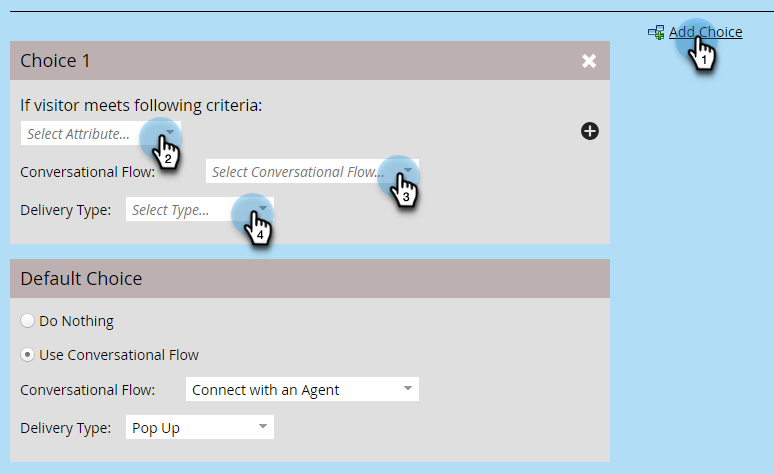

# Impostazioni Di Flusso Per Conversazione Per Marketo Engage Forms{#conversational-flow-settings-for-marketo-engage-forms}

Rendi Marketo Engage Forms conversazionale integrandolo con Dynamic Chat Conversational Flows. Qualifica immediatamente i lead utilizzando i dati del modulo o l&#39;iscrizione a elenchi avanzati per prenotazioni di riunioni, collegamenti a white paper o obiettivi personalizzati.

>[!AVAILABILITY]
>
>Il membro di un elenco avanzato o il criterio Membro di un elenco richiede Dynamic Chat Prime. Per ulteriori informazioni, contatta il team dell’account di Adobe (il tuo Account Manager).

1. Individuare e selezionare il modulo (o crearne uno nuovo).

   

1. Fai clic su **[!UICONTROL Edit Draft]**.

   

1. Nella pagina di modifica del modulo fare clic su **[!UICONTROL Form Settings]**, quindi su **[!UICONTROL Settings]**.

   

1. Fare clic sul dispositivo di scorrimento **[!UICONTROL Conversational Flow Settings]** per attivarlo.

   

1. Verrà visualizzata una finestra modale di scelta predefinita. Seleziona la preferenza. In questo esempio stiamo scegliendo **[!UICONTROL Use Conversational Flow]**.

   

1. Selezionare **[!UICONTROL Conversational Flow]** e **[!UICONTROL Delivery Type]** desiderati.

   

   >[!NOTE]
   >
   >[Ulteriori informazioni sui flussi conversazionali](/help/marketo/product-docs/demand-generation/dynamic-chat/automated-chat/conversational-flow-overview.md){target="_blank"}

   **PASSAGGIO FACOLTATIVO**: è possibile fare clic su **[!UICONTROL Add Choice]** per eseguire il targeting dei visitatori della chat che soddisfano un criterio specifico. Puoi aggiungere fino a nove scelte per un totale di dieci.

   

   >[!NOTE]
   >
   >Il browser del visitatore deve essere utilizzato come cookie come persona nota prima dell’invio del modulo per essere idoneo a essere membro di Static/Smart List.

   **PASSAGGIO FACOLTATIVO**: fare clic sul segno **+** all&#39;interno di ogni passaggio per aggiungere altri attributi, che consentono di restringere il pubblico di destinazione (gli attributi disponibili sono i campi scelti per il modulo). In questo esempio, il targeting è per gli autori tecnici di Adobe in California.

   

   >[!NOTE]
   >
   >Criterio Logica impostata su &quot;all&quot; significa che ogni attributo deve essere soddisfatto per essere qualificato. La logica dei criteri impostata su &quot;any&quot; indica che è sufficiente uno qualsiasi degli attributi.

   **PASSAGGIO FACOLTATIVO**: se si aggiungono due o più scelte, è possibile riordinarle facendo clic sulle relative frecce su/giù.

   

1. Al termine, fai clic su **[!UICONTROL Finish]**.

   
