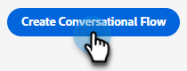

# Creare un flusso conversazionale {#create-a-conversational-flow}

Ecco come creare un nuovo flusso conversazionale.

1. In [!UICONTROL Chat automatizzata], fai clic su **[!UICONTROL Flussi conversazionali]**.

   

1. Fare clic su **[!UICONTROL Crea flusso conversazionale]**.

   

1. Scegli un flusso conversazionale vuoto o uno dei modelli precompilati. Immettere un nome (la descrizione è facoltativa), cambiare la lingua (facoltativo) e fare clic su **[!UICONTROL Crea]**.

   

   >[!NOTE]
   >
   >Questo cambierà solo la lingua del testo di sistema. Sei responsabile della traduzione dei contenuti.

1. Proprio come nelle finestre di dialogo, a questo punto è necessario [creare un flusso](/help/marketo/product-docs/demand-generation/dynamic-chat/automated-chat/stream-designer.md#create-a-stream){target="_blank"}.

>[!MORELIKETHIS]
>
>[Panoramica del flusso conversazionale](/help/marketo/product-docs/demand-generation/dynamic-chat/automated-chat/conversational-flow-overview.md){target="_blank"}
