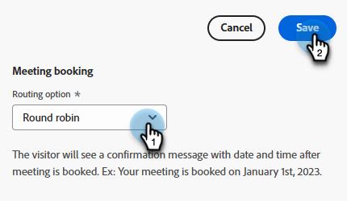

# Designer flusso {#stream-designer}

Sono possibili _molte_ combinazioni di flusso. Questo articolo contiene un esempio in cui l’addetto al marketing chiede al visitatore del sito se ha domande sul prodotto. In caso affermativo, il visitatore può pianificare un appuntamento. In caso negativo, il visitatore ha la possibilità di iscriversi a una mailing list per la corrispondenza futura. Viene anche offerto loro un PDF gratuito. L’obiettivo finale è pianificare un appuntamento o raccogliere l’e-mail del visitatore.

>[!PREREQUISITES]
>
>Prima di poter utilizzare la scheda Documento, devi [configurarla](/help/marketo/product-docs/demand-generation/dynamic-chat/integrations/adobe-pdf-embed-api.md){target="_blank"} nel tuo account Adobe.

## Trasmetti schede Designer {#stream-designer-cards}

Il Designer Stream contiene più schede che è possibile aggiungere per modellare la conversazione chat.

<table>
 <tr>
  <td style="width:25%"><strong>Messaggio</strong></td>
  <td style="width:75%">Da utilizzare quando si desidera effettuare una dichiarazione senza bisogno di risposta (ad esempio: "Ciao! Tutti gli articoli hanno il 25% di sconto oggi con il codice SAVE25").
</td>
 </tr>
 <tr>
  <td style="width:25%"><strong>Domanda</strong></td>
  <td>Da utilizzare quando si desidera porre una domanda a scelta multipla, di cui si forniscono le risposte disponibili (ad esempio: Quale tipo di veicolo si è interessati? Risposte = SUV, Compatto, Camion, ecc.).</td>
 </tr>
 <tr>
  <td style="width:25%"><strong>Documento</strong></td>
  <td>Consente di incorporare documenti PDF nelle finestre di dialogo e di tenere traccia dell’attività di coinvolgimento dei visitatori nei documenti (quante pagine sono state visualizzate, se il documento è stato scaricato e/o qualsiasi termine di ricerca utilizzato).</td>
 </tr>
 <tr>
  <td style="width:25%"><strong>Acquisizione delle informazioni</strong></td>
  <td>Utilizzare quando si desidera raccogliere informazioni (ad esempio, nome, indirizzo e-mail, qualifica, ecc.). Dopo aver scelto il campo a cui attribuire la risposta, puoi scegliere se consentire al visitatore di digitare il testo nella risposta o selezionare le opzioni da un elenco a discesa che hai determinato (suggerimento: quest’ultimo può essere utile per la pulizia del database). Puoi anche scegliere di sovrascrivere i dati attualmente elencati con la relativa risposta, oppure puoi saltare completamente la domanda se disponi già di un valore per essi.</td>
 </tr>
 <tr>
  <td style="width:25%"><strong>Prenotazione riunione</strong></td>
  <td>Fornisce al visitatore un calendario delle date disponibili per pianificare una riunione. Scegli la disponibilità del calendario tramite round robin, un agente specifico o utilizzando regole personalizzate. Fai clic su <b>Aggiungi attributo</b> se desideri acquisire il nome o l'indirizzo e-mail dell'agente e assegnarlo al record della persona del visitatore della chat per eseguire query future (suggerimento: crea un <a href="/help/marketo/product-docs/administration/field-management/create-a-custom-field-in-marketo.md" target="_blank">campo personalizzato</a> per mappare le informazioni dell'agente su in modo da non sovrascrivere un campo Marketo Engage standard).</td>
 </tr>
 <tr>
  <td style="width:25%"><strong>Obiettivo</strong></td>
  <td>Questa è l'unica carta che i visitatori non vedranno. Sta a te determinare a quale punto un obiettivo viene raggiunto all’interno della chat specifica (ad esempio, se l’obiettivo è la raccolta dell’e-mail del visitatore, inserisci la scheda Obiettivo immediatamente dopo Info Capture nel flusso).</td>
 </tr>
 <tr>
  <td style="width:25%"><strong>Azione*</strong></td>
  <td>Simile ai campi nascosti di un modulo, con la scheda delle azioni è possibile compilare qualsiasi attributo del lead o dell'azienda (con tipo di dati <a href="/help/marketo/product-docs/administration/field-management/custom-field-type-glossary.md#string">string</a>) con valori impliciti che si desidera acquisire in base a un record del lead. Puoi aggiungere la scheda delle azioni in qualsiasi punto della conversazione e aggiornare i rispettivi attributi con un valore o token nativi che popolano automaticamente il rispettivo valore.
  
<i>* Questa scheda richiede Dynamic Chat Prime. Per ulteriori informazioni, contatta il team dell’account di Adobe (il tuo Account Manager).</i></td>
 </tr>
 <tr>
  <td style="width:25%"><strong>Live Chat</strong></td>
  <td>Utilizza la scheda chat in diretta quando desideri che i visitatori chattino con un agente in diretta.
  <li>La scheda chat live deve essere l'ultima scheda del ramo.</li>
  <li>I visitatori verranno indirizzati a un agente non appena raggiungono questa scheda nel flusso, pertanto si consiglia di anteporre a questa scheda una scheda con le domande che chiedono ai visitatori se desiderano chattare con un agente live.</li></td>
 </tr>
 <tr>
  <td style="width:25%"><strong>Risposte generate*</strong></td>
  <td>Crea un messaggio per il visitatore per quando raggiunge un determinato punto della conversazione. È possibile impostare una serie di domande da porre contemporaneamente per ottenere l'indicatore di prestazioni chiave desiderato.
  
<i>* Questa scheda richiede Dynamic Chat Prime. Per ulteriori informazioni, contatta il team dell’account di Adobe (il tuo Account Manager).</i></td>
 </tr>
 <tr>
  <td style="width:25%"><strong>Ramificazione condizionale</strong></td>
  <td>Crea rami nei flussi della finestra di dialogo in base a condizioni diverse. Presentare contenuti diversi a persone diverse nella stessa finestra di dialogo in base agli attributi del lead e dell’azienda in Marketo Engage.</td>
 </tr>
 <tr>
  <td style="width:25%"><strong>Flusso conversazionale</strong></td>
  <td>Semplifica più passaggi in un flusso all’interno delle finestre di dialogo utilizzando la scheda Flusso conversazionale.</td>
 </tr>
</table>

## Icone Streaming Designer {#stream-designer-icons}

In alto a destra in Stream Designer sono disponibili alcune icone. Ecco cosa fanno.

<table>
 <tr>
  <td style="width:10%"></td>
  <td>Ingrandisce, creando schede più grandi</td>
 </tr>
 <tr>
  <td style="width:10%"></td>
  <td>Esegue lo zoom indietro, creando schede più piccole</td>
 </tr>
 <tr>
  <td style="width:10%"></td>
  <td>Apre una finestra per il test della chat (premere lo stesso pulsante per chiudere)</td>
 </tr>
 <tr>
  <td style="width:10%"></td>
  <td>Consente di cercare tipi di schede o contenuti all’interno del flusso</td>
 </tr>
 <tr>
  <td style="width:10%"></td>
  <td>Dispone tutte le schede nel flusso</td>
 </tr>
</table>

## Creare un flusso {#create-a-stream}

È possibile creare flussi per le finestre di dialogo o [Forms conversational](/help/marketo/product-docs/demand-generation/dynamic-chat/automated-chat/conversational-flow-overview.md){target="_blank"}. In questo esempio ne creeremo uno per un dialogo.

1. Dopo aver [creato la finestra di dialogo](/help/marketo/product-docs/demand-generation/dynamic-chat/automated-chat/create-a-dialogue.md){target="_blank"}, fare clic sulla scheda **[!UICONTROL Stream Designer]**.

   

1. Trascinare la scheda _[!UICONTROL Question]_.

   

1. In [!UICONTROL Chatbot Response], invia la tua domanda come desideri.

   

   >[!TIP]
   >
   >Puoi personalizzare l’esperienza per i visitatori della chat.
   >
   >* Fare clic sull&#39;icona &quot;Inserisci HTML&quot; `</>` per inserire un HTML personalizzato per ottenere l&#39;aspetto desiderato della conversazione.
   >
   >* Usa i token per i visitatori di chat conosciuti per personalizzare la loro esperienza (es: Ciao `{{lead.leadFirstName:""}}`). Fare clic sull&#39;icona della parentesi graffa `{}` ed effettuare la selezione. Aggiungere un valore predefinito tra le virgolette se si desidera che i visitatori anonimi visualizzino un elemento generico (ad esempio, Hello `{{lead.leadFirstName:"there"}}`).

   >[!NOTE]
   >
   >Poke è impostato su on per impostazione predefinita, il che mostra la domanda di apertura accanto all’icona della chat senza che il visitatore debba fare clic su di essa per visualizzarla. Poke è disponibile solo sulla prima scheda della conversazione.

1. Immettere le risposte utente e fare clic su **[!UICONTROL Save]**.

   

   >[!NOTE]
   >
   >**[!UICONTROL Edit Stored Values]** è un passaggio facoltativo per coloro che desiderano memorizzare nel database un valore diverso da quello visualizzato ai visitatori nel chatbot per gli attributi mappati nella scheda Domanda (ad esempio, il visitatore vede &quot;Ottimizzazione del motore di ricerca&quot;, il valore viene memorizzato come &quot;SEO&quot;).

1. Per &quot;Sì&quot; si desidera prenotare una riunione, quindi trascinare il mouse sulla scheda _Prenotazione riunione_.

   

1. Nella colonna di destra fare clic su **[!UICONTROL Save]**.

   

1. Poiché è un obiettivo, trascinare la scheda [!UICONTROL Goal] sotto l&#39;Utilità di pianificazione appuntamenti.

   

1. Assegna un nome all&#39;obiettivo (o scegliine uno esistente) e fai clic su **[!UICONTROL Save]**.

   

1. Per &quot;No&quot; vogliamo vedere se si uniranno alla mailing list, quindi sotto quell&#39;opzione trascina un&#39;altra scheda [!UICONTROL Question].

   

1. Inserisci la risposta e aggiungi le scelte di risposta per il visitatore. Al termine, fai clic su **[!UICONTROL Save]**.

   

   >[!NOTE]
   >
   >È possibile aggiungere altre risposte facendo clic su **[!UICONTROL Add Response]**.

1. Sotto la risposta &quot;Sì&quot;, trascina sulla scheda Info Capture per raccogliere l’e-mail del visitatore.

   

1. Fare clic sul menu a discesa **[!UICONTROL Type]** e selezionare **[!UICONTROL Email]**.

   

1. Inserisci un messaggio chatbot e un segnaposto. Verificare che l&#39;attributo sia mappato al campo appropriato in Marketo Engage e fare clic su **[!UICONTROL Save]**.

   

   <table>
    <tr>
     <td style="width:30%"><strong>Tipo</strong></td>
     <td>Tipo di informazioni da acquisire: telefono, testo, e-mail.</td>
    </tr>
    <tr>
     <td style="width:30%"><strong>Messaggio del chatbot</strong></td>
     <td>Il messaggio visualizzato dal visitatore che gli chiede di fornire le informazioni.</td>
    </tr>
    <tr>
     <td style="width:30%"><strong>Placeholder</strong></td>
     <td>Testo di esempio che aiuta il visitatore a vedere cosa inserire.</td>
    </tr>
    <tr>
     <td style="width:30%"><strong>Mappa risposta su attributo</strong></td>
     <td>Consente di sincronizzare la risposta del visitatore al campo corrispondente nel record Persona nell’abbonamento Marketo Engage.</td>
    </tr>
   </table>

1. Poiché la raccolta delle e-mail è un obiettivo, trascina la scheda [!UICONTROL Goal] sotto Info Capture.

   

1. Assegna un nome all&#39;obiettivo (o scegliine uno esistente) e fai clic su **[!UICONTROL Save]**.

   

1. Ricordati di aggiungere una risposta se dicono &quot;No&quot;. Un&#39;opzione consiste nel trascinare una scheda Messaggio qui sotto e dire &quot;grazie comunque&quot;. In questo esempio, forniremo loro invece un documento PDF gratuito.

   

1. In questo esempio verrà creato un nuovo documento. Assegnare un nome, immettere l&#39;URL del PDF già ospitato e fare clic su **[!UICONTROL Save]**.

   

1. Seleziona l&#39;interruttore **[!UICONTROL Preview]** per visualizzare l&#39;anteprima della finestra di dialogo.

   

1. Quando sei pronto ad attivare la tua finestra di dialogo, fai clic su **[!UICONTROL Publish]**.

   

>[!NOTE]
>
>Prima di fare clic su [!UICONTROL Publish], assicurati di aver [inserito gli URL di destinazione](/help/marketo/product-docs/demand-generation/dynamic-chat/automated-chat/audience-criteria.md#target){target="_blank"}.

>[!MORELIKETHIS]
>
>* [Crea un dialogo](/help/marketo/product-docs/demand-generation/dynamic-chat/automated-chat/create-a-dialogue.md){target="_blank"}
>* [Criteri pubblico](/help/marketo/product-docs/demand-generation/dynamic-chat/automated-chat/audience-criteria.md){target="_blank"}
>* [API per l&#39;incorporamento di Adobe PDF](/help/marketo/product-docs/demand-generation/dynamic-chat/integrations/adobe-pdf-embed-api.md){target="_blank"}
