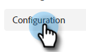

# Configurazione {#configuration}

Scopri come personalizzare l’aspetto della finestra di dialogo chatbot.

Per iniziare, fai clic su **Configurazione**.

Sono disponibili diverse opzioni di personalizzazione.

## Scheda Stile {#style-tab}

**Stile**

Qui è dove si definirà l&#39;aspetto e la sensazione del chatbot in cui verranno mostrati i dialoghi, tra cui: colori, caratteri, posizionamento del widget bot e nome/avatar del chatbot.

Il colore di ciascuna categoria è determinato da un valore di colore esadecimale ](https://color.adobe.com/create/color-wheel) (ad esempio, bianco = #ffffff, rosso = #bf1932, ecc.).[

L’ancoraggio consente al visitatore del sito di aprire/chiudere la casella di controllo. Puoi scegliere se visualizzare l’icona in basso a destra o in basso a sinistra. Puoi anche aumentare o diminuire la spaziatura (la quantità di spazio tra l’icona e il fondo della pagina web).

**Impostazioni agente**

In Impostazioni agente puoi aggiungere un&#39;etichetta alla tua casella di controllo (ad esempio: &quot;Punto Adobe&quot;) che apparirà in cima ad esso. Puoi anche determinare il ritardo di risposta (in secondi) e cambiare l&#39;avatar della chat.

Dopo aver apportato le modifiche, ricorda di fare clic su **Salva**.

## Scheda Privacy {#privacy-tab}

Fai clic sulla scheda **Privacy** per aggiungere/modificare l’URL dell’informativa sulla privacy del sito (facoltativo).

## Scheda di installazione {#installation-tab}

Affinché il chatbot possa essere visualizzato sul tuo sito web, devi prima installare lo snippet JavaScript per chat dinamica. Fai clic su questa scheda per trovare/copiare il codice necessario. Se non conosci questa operazione, contatta il tuo team web o il reparto IT per assistenza.

>[!NOTE]
>
>Il supporto Marketo non è configurato per fornire assistenza nella risoluzione dei problemi di HTML. Per assistenza su HTML, consulta uno sviluppatore web.
