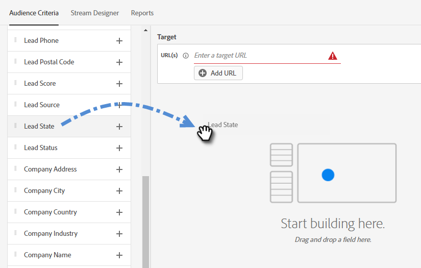

# Finestre di dialogo {#dialogues}

Le finestre di dialogo sono le singole conversazioni di chat che configurerai. Scopri come personalizzarle visivamente, determinare quali pagine visualizzano e decidere cosa dicono e chi le visualizza.

## Creare una nuova finestra di dialogo {#create-a-new-dialogue}

1. Fare clic su **Finestre di dialogo**.

   

1. Fare clic sul pulsante **Crea nuovo**.

   

1. Immetti un nome (la descrizione è facoltativa), imposta il livello di priorità e fai clic su **Salva**.

   

>[!NOTE]
>
>Il livello di priorità determina la posizione della finestra di dialogo nell’elenco (ad esempio: priorità = 1 significa che sarà all&#39;inizio).

## Criteri del pubblico {#audience-criteria}

Analogamente agli elenchi avanzati di Marketo, gli attributi dei criteri per il pubblico consentono di definire il pubblico di destinazione. Puoi eseguire il targeting di lead noti o sconosciuti utilizzando attributi dedotti, lead o aziendali (o una combinazione di essi).

**Lead noti**

Ci sono _molte combinazioni di attributi_ tra cui scegliere. In questo esempio, il targeting di tutti i **lead noti** in California che lavorano in un&#39;azienda con più di 50 dipendenti.

1. Prendi l’attributo **Stato lead** e trascinalo a destra.

   

1. __ Isis impostato per impostazione predefinita. Nel campo Seleziona valori digitare CA (è inoltre possibile fare clic sul menu a discesa e selezionare dall’elenco).

   

1. Prendi l&#39;attributo **Dimensione società** e trascinalo nel punto in cui è indicato _trascina e rilascia un attributo qui_.

   

   >[!NOTE]
   >
   >Puoi anche scegliere un attributo facendo clic sulla relativa icona **+**.

1. Fai clic sull’elenco a discesa dell’operatore e seleziona **Maggiore di**.

   

1. Digitare 50 e fare clic in un altro punto dello schermo per salvare.

   

**Lead anonimi**

Esiste un modo semplice per eseguire il targeting specifico dei lead che non sono ancora presenti nel database. In questo esempio, eseguiamo il targeting di tutti i **lead anonimi** situati nell&#39;area di New York.

1. Prendi l’attributo **E-mail lead** e trascinalo a destra.

   

1. Fai clic sull’elenco a discesa dell’operatore e seleziona **È vuoto**.

   

1. Acquisisci l&#39;attributo **Stato di provenienza** e trascinalo nel punto in cui è indicato _trascina e rilascia un attributo qui_.

   

   >[!NOTE]
   >
   >SPIEGHI INFERITI.

1. __ Isis impostato per impostazione predefinita. Nel campo Seleziona valori digitare NY (è inoltre possibile fare clic sull’elenco a discesa e selezionarlo dall’elenco).

   

## Aggiungi gruppi {#add-groups}

Hai anche la possibilità di raggruppare gli attributi, nel caso in cui desideri avere tutti gli attributi insieme a &quot;qualsiasi&quot; di un altro.

FINISCI QUESTO

## Target {#target}

In questa finestra immetti gli URL su cui desideri visualizzare una finestra di dialogo specifica.

Formati accettabili:

* `http://website.com`
* `https://*.website.com`
* `http://website.com/folder/*`
* `https://*.website.com/folder/*`

>[!NOTE]
>
>L&#39;utilizzo di un asterisco funge da jolly catch-all. Quindi `https://*.website.com` inserirebbe la finestra di dialogo su ogni pagina del sito, inclusi i sottodomini (ad esempio: `support.website.com`). E `https://website.com/folder/*` inseriva la finestra di dialogo in ogni pagina HTML della cartella successiva (ad esempio: in questo caso diciamo che la cartella è &quot;sport&quot;, quindi: website.com/sports/baseball.html, website.com/sports/football.html, ecc.).

## Progettazione flussi {#stream-designer}

Il designer del flusso contiene diverse schede che è possibile aggiungere per modellare la conversazione di chat.

<table>
 <tr>
  <td><strong>Messaggio</strong></td>
  <td>Utilizzare quando si desidera eseguire un'istruzione senza alcuna risposta necessaria (ad esempio: "Ciao! Tutti gli articoli sono 25% off oggi con codice SAVE25").
</td>
 </tr>
 <tr>
  <td><strong>Domanda</strong></td>
  <td>Utilizzare quando si desidera porre una domanda a scelta multipla, di cui fornire le risposte disponibili (ad esempio: A che tipo di veicolo ti interessa? Risposte = SUV, compatto, camion, ecc.).</td>
 </tr>
 <tr>
  <td><strong>Acquisizione delle informazioni</strong></td>
  <td>Utilizza quando desideri raccogliere informazioni. I tre campi tra cui scegliere sono Indirizzo e-mail, Numero di telefono e Testo (che consente al visitatore di scrivere il proprio messaggio).</td>
 </tr>
 <tr>
  <td><strong>Scheduler appuntamenti</strong></td>
  <td>Fornisce al visitatore un calendario delle date disponibili per pianificare un follow-up. La disponibilità del calendario riflette [l’agente successivo in linea](/help/marketo/product-docs/demand-generation/dynamic-chat/dynamic-chat-overview.md#routing).</td>
 </tr>
 <tr>
  <td><strong>Obiettivo</strong></td>
  <td>Questa è l'unica carta che i visitatori non vedranno. Sta a te determinare a quale punto un obiettivo viene raggiunto all'interno della chat specifica (es: se la raccolta dell'e-mail del visitatore è l'obiettivo, posiziona la scheda Obiettivo dopo l'acquisizione delle informazioni nello streaming).</td>
 </tr>
</table>

MOSTRA GLI ESEMPI SEGUENTI

## Rapporti {#reports}

Testo
