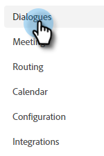

# Creare una finestra di dialogo {#create-a-dialogue}

Ecco come creare una nuova finestra di dialogo.

1. Fai clic su **Finestre di dialogo**.

   

1. Fai clic sul pulsante **Crea nuovo** pulsante .

   

1. Scegliere una finestra di dialogo vuota o uno dei modelli precompilati. Immetti un nome (la descrizione è facoltativa), modifica il livello di priorità (facoltativo) e fai clic su **Crea**.

   

>[!NOTE]
>
>La priorità determina quale finestra di dialogo verrà visualizzata a un visitatore quando si qualificano per più finestre di dialogo contemporaneamente.

>[!MORELIKETHIS]
>
>* [Criteri del pubblico](/help/marketo/product-docs/demand-generation/dynamic-chat/dialogues/audience-criteria.md){target=&quot;_blank&quot;}
>* [Progettazione flussi](/help/marketo/product-docs/demand-generation/dynamic-chat/dialogues/stream-designer.md){target=&quot;_blank&quot;}
>* [Rapporti](/help/marketo/product-docs/demand-generation/dynamic-chat/dialogues/reports.md){target=&quot;_blank&quot;}

