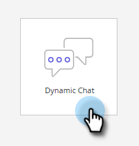

# Panoramica della chat dinamica {#dynamic-chat-overview}

La chat dinamica consente di sfruttare un&#39;interfaccia di facile utilizzo per eseguire il targeting sia per le persone che per gli account che visitano il tuo sito web. Raccogli contenuti pertinenti quali nome, informazioni di contatto e testo libero. I visitatori del sito possono anche prenotare riunioni con il team di vendita. I dati di attività e coinvolgimento della chat dinamica possono essere utilizzati per aggiungere membri ai programmi Marketo e attivare attività cross-channel.

>[!NOTE]
>
>La chat dinamica sta per essere implementata gradualmente ed è attualmente a disponibilità limitata. Questa pagina verrà aggiornata con i dettagli di disponibilità generale (GA) man mano che diventano disponibili.

>[!TIP]
>
>Visita [questa pagina](https://experienceleague.adobe.com/docs/marketo-learn/tutorials/dynamic-chat/dynamic-chat-overview.html) per visualizzare i video tutorial della chat dinamica.

## Integrazioni {#integrations}

Un componente chiave della chat dinamica è la sua capacità di interfaccia nativa con il tuo abbonamento Marketo. Per sfruttare appieno la funzionalità di questa integrazione, è innanzitutto necessario avviare la sincronizzazione dei dati. A seconda delle dimensioni del database Marketo, potrebbero essere necessarie fino a 24 ore per i dati iniziali, [sincronizzazione una tantum](/help/marketo/product-docs/demand-generation/dynamic-chat/integrations/connect-dynamic-chat-to-marketo.md) da completare.

Viene sincronizzato quanto segue:

* Dati del campo Persona
* Dati sul campo dell&#39;azienda
* Dati attività

## Dialoghi {#dialogues}

Le finestre di dialogo rappresentano un singolo coinvolgimento di chat. Immaginalo come un contenitore con tutte le cose necessarie per avere un dialogo chat coinvolgente con i visitatori del tuo sito web. In ciascuna finestra di dialogo è possibile specificare le pagine sulle quali si desidera visualizzare la finestra di dialogo, le relative pagine e il contenuto e il flusso della finestra stessa. Inoltre, puoi trovare le metriche per vedere le prestazioni della finestra di dialogo. [Ulteriori informazioni sulle finestre di dialogo](/help/marketo/product-docs/demand-generation/dynamic-chat/dialogues/dialogue-overview.md){target="_blank"}.

## Configurazione {#configuration}

Nella scheda Configurazione, personalizzare l&#39;aspetto delle varie finestre di dialogo. Cambia font, colori, tempo di risposta e altro ancora! [Ulteriori informazioni sulla configurazione](/help/marketo/product-docs/demand-generation/dynamic-chat/configuration.md){target="_blank"}.

## Calendario {#calendar}

Collegare il calendario di Outlook o Gmail per l&#39;utilizzo nella pianificazione degli appuntamenti nel chatbot. [Ulteriori informazioni su Calendario](/help/marketo/product-docs/demand-generation/dynamic-chat/appointment-scheduling/calendar.md){target="_blank"}

## Meeting {#meetings}

Qui puoi vedere tutti gli appuntamenti pianificati dai visitatori del sito web attraverso le varie finestre di dialogo. [Ulteriori informazioni sulle riunioni](/help/marketo/product-docs/demand-generation/dynamic-chat/appointment-scheduling/meetings.md){target="_blank"}

## Indirizzamento {#routing}

Qui puoi vedere un elenco di tutti gli agenti che hanno connesso i loro calendari, l’ordine in cui verranno presentati ai visitatori del sito web e creare regole di indirizzamento personalizzate. [Ulteriori informazioni sull&#39;indirizzamento](/help/marketo/product-docs/demand-generation/dynamic-chat/appointment-scheduling/routing.md){target="_blank"}

## Domande frequenti {#faq}

**Posso installare la chat dinamica in qualsiasi punto del sito web della mia azienda o funziona solo sulle pagine di destinazione di Marketo?**

Lo snippet JavaScript per chat dinamica può essere installato su qualsiasi sito web e sulle pagine di destinazione di Marketo.

**Per quanto tempo vengono memorizzati i dati per il reporting?**

90 giorni (vedi l&#39;elenco completo dei limiti) [di seguito](#limits-in-dynamic-chat)).

**La chat dinamica consente la chat dal vivo?**

No, utilizza solo risposte predeterminate.

**Dynamic Chat supporta lingue diverse dall&#39;inglese?**

Sì. La chat dinamica supporta le seguenti lingue: Francese, tedesco, giapponese, spagnolo, italiano, portoghese brasiliano, coreano, cinese semplificato e cinese tradizionale. Ulteriori informazioni nel [sezione sottostante](#changing-the-language).

**Supporta la funzionalità AI/NLP?**

Non è supportata la funzionalità AI/NLP.

**Come posso indirizzare le persone anonime?**

Nella finestra di dialogo, devi utilizzare il _L&#39;e-mail della persona è vuota_ attributo.

## Modifica della lingua {#changing-the-language}

Segui questi passaggi per modificare la lingua chat dinamica.

>[!IMPORTANT]
>
>La modifica della lingua a livello di profilo modificherà la lingua per _tutto_ Applicazioni di Experience Cloud, non solo Chat dinamica.

1. Nell&#39;account di Experience Cloud, fai clic sull&#39;icona delle impostazioni e scegli **Preferenze**.

   

1. Fai clic sulla lingua corrente nell’indirizzo e-mail.

   

1. Scegli la nuova lingua (la seconda lingua è facoltativa) e fai clic su **Salva**.

   

   >[!NOTE]
   >
   >Ci sono alcune dozzine di lingue tra cui scegliere, tuttavia, Dynamic Chat supporta solo quanto segue: Inglese, francese, tedesco, giapponese, spagnolo, italiano, portoghese brasiliano, coreano, cinese semplificato e cinese tradizionale.

Quando aggiorni la lingua, tutto ciò che si trova nell’app stessa cambia, ad eccezione delle parole che hai popolato personalmente (ad esempio, le risposte in streaming).

## Limiti della chat dinamica {#limits-in-dynamic-chat}

<table>
  <th>Parametro</th>
  <th>Descrizione</th>
  <th>Limite</th>
 <tr>
  <td>Finestre di dialogo totali</td>
  <td>Numero di finestre di dialogo (pubblicate e bozza)</td>
  <td>500</td>
 </tr>
 <tr>
  <td>Calendari totali</td>
  <td>Numero di calendari collegati</td>
  <td>25</td>
 </tr>
 <tr>
  <td>Totale utenti (amministratori e utenti marketing)</td>
  <td>Numero di utenti combinati consentiti per istanza di chat dinamica</td>
  <td>50</td>
 </tr>
 <tr>
  <td>Finestre di dialogo pubblicate</td>
  <td>Numero di finestre di dialogo pubblicate salvate</td>
  <td>100</td>
 </tr>
 <tr>
  <td>URL di destinazione per finestra di dialogo</td>
  <td>Numero di URL di destinazione che possono essere aggiunti a un’unica finestra di dialogo</td>
  <td>20</td>
 </tr>
 <tr>
  <td>Attributi per finestra di dialogo</td>
  <td>Numero di attributi che possono essere aggiunti ai criteri del pubblico per una singola finestra di dialogo</td>
  <td>100</td>
 </tr>
 <tr>
  <td>Gruppi</td>
  <td>Numero di gruppi che possono essere aggiunti a una singola finestra di dialogo</td>
  <td>10</td>
 </tr>
 <tr>
  <td>Attributi per gruppo</td>
  <td>Numero di attributi che possono essere aggiunti a un gruppo</td>
  <td>10</td>
 </tr>
 <tr>
  <td>Schede</td>
  <td>Numero di schede che possono essere aggiunte all’area di lavoro per finestra di dialogo</td>
  <td>500</td>
 </tr>
 <tr>
  <td>Periodo di conservazione dei dati lead anonimi</td>
  <td>Durata per quanto tempo verranno mantenute le informazioni di un lead anonimo senza alcun coinvolgimento</td>
  <td>90 giorni</td>
 </tr>
 <tr>
  <td>Periodo di conservazione dell’attività dell’obiettivo</td>
  <td>Quantità di dati dell’attività dell’obiettivo temporale conservati</td>
  <td>24 mesi</td>
 </tr>
 <tr>
  <td>Periodo di conservazione dell’attività del documento</td>
  <td>Quantità di dati di attività del documento a tempo determinato conservati</td>
  <td>24 mesi</td>
 </tr>
 <tr>
  <td>Interagito con il periodo di conservazione dell’attività della finestra di dialogo</td>
  <td>Il tempo interagito con i dati dell’attività Dialogo viene mantenuto</td>
  <td>90 giorni</td>
 </tr>
 <tr>
  <td>Periodo di conservazione dell'attività di prenotazione riunioni</td>
  <td>Quantità di tempo durante la prenotazione delle riunioni verrà memorizzata in Chat dinamico</td>
  <td>24 mesi</td>
 </tr>
 <tr>
  <td>Conversazioni interessate</td>
  <td>Numero di conversazioni via chat con cui i visitatori web possono essere coinvolti al mese</td>
  <td>250</td>
 </tr>
 <tr>
  <td>Conversazioni innescate</td>
  <td>Numero di conversazioni via chat che possono essere mostrate ai visitatori web al mese</td>
  <td>25,000</td>
 </tr>
</table>
