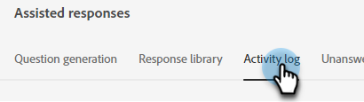
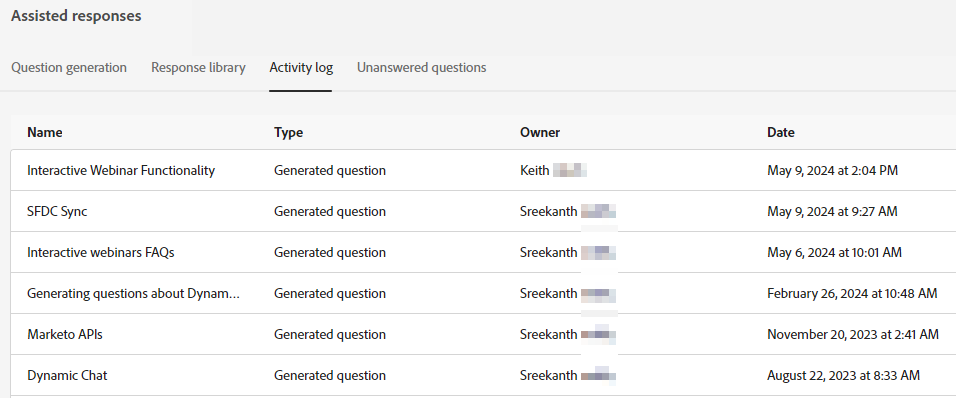

# Registro delle attività {#activity-log}

Visualizzare un elenco di tutte le attività e dei relativi dettagli di accompagnamento, inclusi nome, proprietario, tipo e autore e quando sono state modificate.

1. In IA generativa fare clic su **[!UICONTROL Assisted responses]**.

   

1. Fai clic sulla scheda **[!UICONTROL Activity log]**.

   

1. Tutte le attività dell’istanza vengono visualizzate in un’unica posizione.

   
