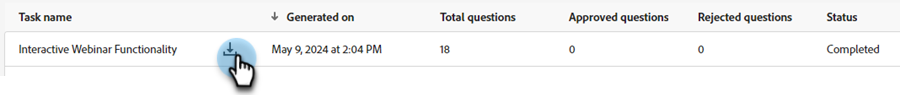

# Generazione di domande {#question-generation}

Visualizza tutte le attività e i relativi dettagli pertinenti, ad esempio quando sono state generate, il numero totale di domande, lo stato di approvazione e altro ancora.

## Genera domande {#generate-questions}

1. In IA generativa fare clic su **[!UICONTROL Assisted responses]**.

   

1. Fai clic su **[!UICONTROL Generate questions]**.

   

1. Assegna un nome all’attività e inserisci un URL di origine (fino a 10) dal quale verrà estratto tutto il contenuto. Immettere gli argomenti/parole chiave desiderati e premere Invio sulla tastiera. Al termine, fare clic su **[!UICONTROL Generate]**.

   

   >[!IMPORTANT]
   >
   >Per garantire che Marketo Engage possa eseguire il raschiamento del contenuto dagli URL forniti, devi prima inserire nell&#39;elenco Consentiti diversi indirizzi IP. [Per ulteriori dettagli, vedere di seguito](#ip-addresses-to-allowlist).

   >[!NOTE]
   >
   >I siti e le pagine devono essere pubblici (ovvero non nascosti dietro un accesso) affinché le loro informazioni possano essere raschiate.

1. In base al contenuto, la generazione di domande e risposte può richiedere fino a 30 minuti. Fai clic su **[!UICONTROL OK]**.

   

   >[!TIP]
   >
   >Premi Aggiorna per visualizzare lo stato più recente della generazione delle domande.

   

## Scaricare domande e risposte {#download-questions-and-responses}

>[!NOTE]
>
>Le domande e le risposte generate sono visualizzabili anche nella [Libreria risposte](/help/marketo/product-docs/demand-generation/dynamic-chat/generative-ai/response-library.md).

1. Trova l’attività desiderata e fai clic sull’icona Scarica accanto al nome.

   

1. Individua la cartella dei download nel browser e seleziona il file. Questo aspetto può variare a seconda del browser utilizzato.

   

1. Nel file di Excel, **[!DNL Task details]** mostra solo questo, vari dettagli sull&#39;attività, comprese le istruzioni su come aggiungere/modificare domande e/o risposte.

   

   >[!NOTE]
   >
   >Se decidi di aggiungere/modificare domande e/o risposte in blocco, [scopri come ricaricarle qui](/help/marketo/product-docs/demand-generation/dynamic-chat/generative-ai/response-library.md).

1. La scheda **[!DNL Q&Rs]** fornisce ulteriori dettagli, incluse le domande e le risposte generate.

   

## INSERIRE NELL&#39;ELENCO CONSENTITI Indirizzi IP da {#ip-addresses-to-allowlist}

Per abilitare l’estrazione dei contenuti dagli URL web durante la generazione di domande e risposte, individua la tua regione di seguito e assicurati che l’indirizzo IP associato sia inserito nell&#39;elenco Consentiti dal team web.

<table width="450">
<thead>
  <tr>
    <th>America del Nord</th>
    <th>Europa</th>
    <th>APAC</th>
  </tr>
</thead>
<tbody>
  <tr>
    <td>13 68 17 252</td>
    <td>20 105 150 224</td>
    <td>20 213 91 77</td>
  </tr>
</tbody>
</table>
