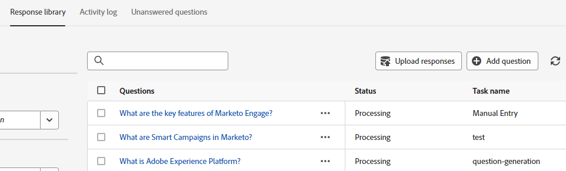

# Domande senza risposta {#unanswered-questions}

Vedi tutte le domande a cui il chatbot non ha risposto o quelle a cui i visitatori sono stati contrassegnati come &quot;non utili&quot; e utilizza queste preziose informazioni per creare ulteriori risposte pre-approvate.

>[!NOTE]
>
>L&#39;elenco delle domande senza risposta viene aggiornato automaticamente ogni 24 ore.

1. In IA generativa, fai clic su **Risposte assistite**.

   

1. Fai clic su **Domande senza risposta** scheda.

   

1. Seleziona la domanda senza risposta per la quale desideri generare una risposta.

   

1. Inserisci la tua risposta. Assegna un argomento e aggiungi un URL facoltativo che gli utenti possono condividere con i visitatori. Clic **Salva** al termine.

   

1. La domanda senza risposta viene ora risolta e aggiunta automaticamente alla libreria delle risposte.

   
