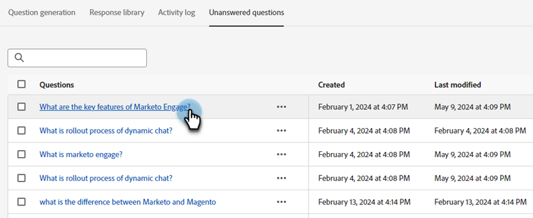

# Domande senza risposta {#unanswered-questions}

Vedi tutte le domande a cui il chatbot non ha risposto e/o quelle a cui i visitatori sono stati contrassegnati come &quot;non utili&quot; e utilizza queste preziose informazioni per creare risposte aggiuntive pre-approvate.

>[!NOTE]
>
>L&#39;elenco delle domande senza risposta viene aggiornato automaticamente ogni 24 ore, a mezzanotte PST.

1. In IA generativa fare clic su **[!UICONTROL Risposte assistite]**.

   

1. Fai clic sulla scheda **[!UICONTROL Domande senza risposta]**.

   

1. Seleziona la domanda senza risposta per la quale desideri creare una risposta.

   

1. Inserisci la tua risposta. Assegna un argomento e aggiungi un URL facoltativo che gli utenti possono condividere con i visitatori. Al termine, fai clic su **[!UICONTROL Salva]**.

   

1. La domanda senza risposta viene ora risolta e aggiunta automaticamente alla libreria delle risposte.

   
