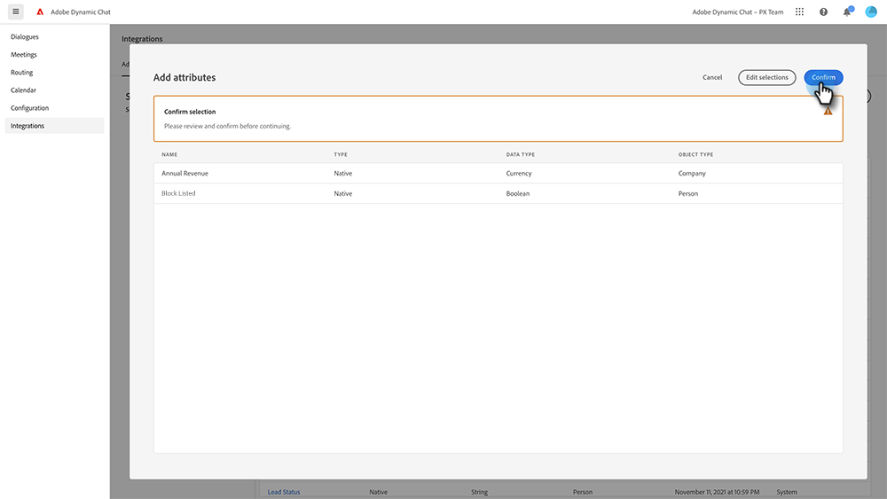

# Adobe Marketo Engage {#adobe-marketo-engage}

## Connessione a Dynamic Chat {#connecting-dynamic-chat}

Dopo aver completato la [configurazione iniziale](/help/marketo/product-docs/demand-generation/dynamic-chat/setup-and-configuration/initial-setup.md){target="_blank"}, è necessario eseguire la sincronizzazione una tantum tra Dynamic Chat e la sottoscrizione a Adobe Marketo Engage.

>[!NOTE]
>
>Dynamic Chat supporta la sincronizzazione di [Marketo native](https://experienceleague.adobe.com/en/docs/marketo-developer/marketo/rest/lead-database/field-types){target="_blank"} e dei campi persona e azienda personalizzati.

1. In Il mio Marketo, fare clic sul riquadro **[!UICONTROL Dynamic Chat]**.

   

   >[!NOTE]
   >
   >Se non vedi il riquadro, rivolgiti al tuo amministratore Marketo.

1. Se in precedenza hai effettuato l’accesso a un’applicazione con un Adobe ID, verrai indirizzato direttamente a Dynamic Chat. In caso contrario, [configura il tuo Adobe ID](https://helpx.adobe.com/manage-account/using/create-update-adobe-id.html){target="_blank"}.

1. Per connettere la tua istanza di Marketo, seleziona **[!UICONTROL Integrations]**.

   

1. Nella scheda Marketo, fare clic su **[!UICONTROL Initiate Sync]**.

   

1. Seleziona fino a 50 attributi (campi standard o personalizzati) dalla tua istanza di Marketo per sincronizzarli con Dynamic Chat e utilizzarli nel targeting del pubblico, nella mappatura dei dati e nella personalizzazione. Al termine, fai clic su **[!UICONTROL Next]**.

   

1. Controllare le selezioni. Fare clic su **[!UICONTROL Confirm]** per avviare la sincronizzazione.

   

>[!NOTE]
>
>Il completamento della sincronizzazione può richiedere da 2 a 24 ore, a seconda delle dimensioni del database.

## Aggiungi un attributo {#add-an-attribute}

Dopo la sincronizzazione iniziale, ecco come aggiungere attributi aggiuntivi.

1. In **[!UICONTROL Integrations]**, assicurarsi che la scheda **[!UICONTROL Adobe Marketo Engage]** sia selezionata e fare clic su **[!UICONTROL Add Attribute]**.

   

1. Selezionare gli attributi da aggiungere e fare clic su **[!UICONTROL Next]**.

   

1. Verificare le selezioni e fare clic su **[!UICONTROL Confirm]**.

   

## Rimuovere un attributo {#remove-an-attribute}

Dopo la sincronizzazione iniziale, ecco come rimuovere un attributo.

>[!NOTE]
>
>L&#39;opzione per rimuovere un attributo è disponibile solo se non è attualmente utilizzato da finestre di dialogo.

1. In **[!UICONTROL Integrations]**, assicurarsi che la scheda **[!UICONTROL Adobe Marketo Engage]** sia selezionata e fare clic sull&#39;attributo che si desidera rimuovere.

   

1. Fai clic su **[!UICONTROL Remove Attribute]**.

   

>[!MORELIKETHIS]
>
>[Configurazione iniziale](/help/marketo/product-docs/demand-generation/dynamic-chat/setup-and-configuration/initial-setup.md){target="_blank"}
