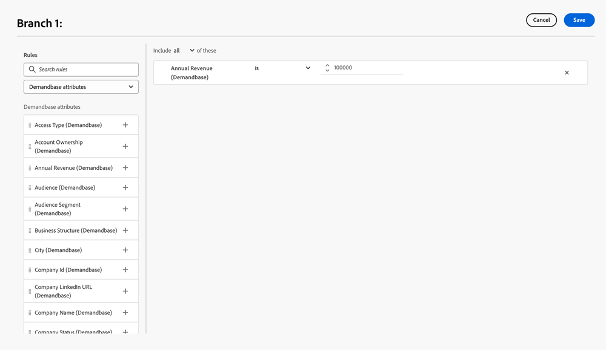

# Demandbase {#demandbase}

Gli utenti Demandbase possono utilizzare gli attributi persona Demandbase per il targeting delle finestre di dialogo, il branding condizionale e il routing personalizzato in Dynamic Chat.

## Accedere alla chiave API per Dynamic Chat {#access-the-api-key-for-dynamic-chat}

I passaggi seguenti devono essere eseguiti _nell&#39;account Demandbase_.

1. In Demandbase fare clic sull&#39;icona _Impostazioni_.

   

1. In _Integrazioni_, seleziona **Connettore account**.

1. Fare clic sul pulsante **+ Crea nuovo**.

1. Nel menu a discesa _Nome integrazione_, selezionare **Adobe Dynamic Chat**.

1. Selezionare il pulsante di opzione **Lato server**.

1. Fai clic su **Crea**.

1. Utilizzando l&#39;icona _copia_, copia la stringa del token API nella parte inferiore della pagina.

1. Invia un ticket con [Supporto Marketo](https://nation.marketo.com/t5/support/ct-p/Support) e fornisci la stringa token API per attivare l&#39;integrazione Demandbase.

>[!NOTE]
>
>Per ulteriori informazioni, vedere [Configurare Demandbase per inviare dati a un&#39;integrazione (connettore account)](https://support.demandbase.com/hc/en-us/articles/360057169531-Set-Up-Demandbase-to-Send-Data-to-an-Integration-Account-Connector){target="_blank"} nel sito della Guida di Demandbase.

## Funzioni di integrazione {#integration-features}

Puoi indirizzare il pubblico in base agli attributi Demandbase oltre agli attributi nativi e personalizzati, durante la creazione di una finestra di dialogo o di un flusso conversazionale.

Utilizzare Attributi Demandbase come condizione nella diramazione condizionale, in una finestra di dialogo o in un flusso conversazionale.

Utilizzare Attributi Demandbase durante la definizione di una logica di routing personalizzata.

