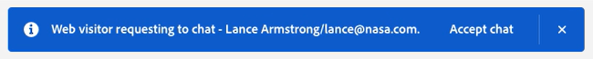

# Panoramica sulla chat live {#live-chat-overview}

La chat in tempo reale consente ai visitatori del sito web di intrattenere conversazioni in chat in tempo reale con i tuoi agenti di vendita.

>[!NOTE]
>
>Per coloro che fanno parte del pacchetto Dynamic Chat Select, la chat in diretta è una funzione di prova con un limite di durata di 100 engagement. Quando questo limite viene raggiunto, tutti i visitatori che richiedono di chattare con un agente live non saranno connessi e riceveranno invece il messaggio di fallback globale. Per aumentare il limite, contatta il rappresentante del tuo account Adobe per informazioni sulle opzioni di aggiornamento del pacchetto.

## Aggiungi agenti chat in tempo reale {#add-live-chat-agents}

Per iniziare a utilizzare la chat in diretta, devi aggiungere i tuoi agenti chat in diretta come [utenti in Adobe Admin Console](/help/marketo/product-docs/demand-generation/dynamic-chat/setup-and-configuration/add-or-remove-chat-users.md#add-a-chat-user){target="_blank"} e concedere loro l&#39;autorizzazione [chat in diretta](/help/marketo/product-docs/demand-generation/dynamic-chat/setup-and-configuration/permissions.md){target="_blank"}. Al termine dell&#39;operazione, sarà possibile aggiungere una [scheda chat in diretta](#using-the-live-chat-card) a una finestra di dialogo nuova o esistente.

Quando i visitatori richiedono di chattare con un agente tramite la finestra di dialogo, gli agenti avranno più [opzioni di notifica](/help/marketo/product-docs/demand-generation/dynamic-chat/live-chat/agent-inbox.md#live-chat-notifications){target="_blank"}. Quando fanno clic sulla notifica, vengono reindirizzati alla [Posta in arrivo agente](/help/marketo/product-docs/demand-generation/dynamic-chat/live-chat/agent-inbox.md){target="_blank"}, dove possono iniziare a chattare con il visitatore.

>[!NOTE]
>
>L’avatar dell’agente live utilizza l’immagine del profilo dell’account Adobe dell’agente. Per aggiornare l&#39;immagine, segui [questi passaggi](https://helpx.adobe.com/it/manage-account/using/edit-adobe-account-personal-profile.html){target="_blank"}.

## Utilizzo della scheda Live Chat {#using-the-live-chat-card}

Utilizza la scheda chat in diretta in [Stream Designer](/help/marketo/product-docs/demand-generation/dynamic-chat/automated-chat/stream-designer.md){target="_blank"} quando desideri che i visitatori chattino con un agente in diretta.

>[!IMPORTANT]
>
>La scheda della chat in diretta deve essere sempre l’ultima scheda del ramo. Se la scheda viene posizionata in un punto casuale nel ramo, potrebbe sorprendere il visitatore collegandolo improvvisamente a un agente.

### Best practice {#best-practices}

* Utilizza una scheda domande prima della scheda chat in diretta in cui si chiede al visitatore se desidera connettersi.
* Una volta che il visitatore accetta di connettersi, utilizza la scheda di acquisizione delle informazioni per raccogliere alcune delle sue informazioni, come nome/cognome, indirizzo e-mail, qualifica professionale, ecc. (si consiglia di richiedere almeno nome e indirizzo e-mail).

## Opzioni scheda chat in diretta {#live-chat-card-options}

Facendo clic sulla scheda della chat dal vivo nel flusso, puoi scegliere come indirizzare il visitatore. Scegli tra round robin, un agente, regole personalizzate o un team.

<table>
 <tbody>
  <tr>
   <td><b>Round robin</b></td>
   <td>Le chat vengono assegnate agli agenti in ordine sequenziale.</td>
  </tr>
  <tr>
   <td><b>Agente</b></td>
   <td>Scegli un agente specifico per ricevere la chat.</td>
  </tr>
    <tr>
   <td><b>Regole personalizzate</b></td>
   <td>Tutte le regole personalizzate vengono esaminate ogni volta che si considera dove indirizzare il visitatore. Se il visitatore non è idoneo per nessuna regola personalizzata, riceve il <a href="/help/marketo/product-docs/demand-generation/dynamic-chat/setup-and-configuration/agent-management.md#live-chat-fallback" target="_blank">messaggio di fallback della chat in tempo reale</a>.</td>
  </tr>
  <tr>
   <td><b>Team</b></td>
   <td>Scegli un team specifico per ricevere la chat. Se questa opzione è selezionata, verrà assegnato round robin all'interno del team.</td>
  </tr>
 </tbody>
</table>

## Notifiche chat in diretta {#live-chat-notifications}

>[!IMPORTANT]
>
>Per ricevere le notifiche del browser per la chat in tempo reale, tutti gli agenti chat in tempo reale devono abilitare le notifiche del browser per Dynamic Chat quando richiesto.

### Abilitazione delle notifiche {#enabling-notifications}

Gli agenti di chat live visualizzeranno un banner nella parte superiore dello schermo quando effettuano l’accesso che recita &quot;Abilita le notifiche del browser per ricevere le notifiche di chat live&quot;. Fare clic su **Abilita**.

Agli agenti di chat live verrà quindi richiesto dal browser di visualizzare le notifiche. Fare clic su **Consenti**.

Se gli agenti non ricevono le notifiche del browser anche dopo averlo consentito nel browser, potrebbe essere necessario abilitare le notifiche per il browser nelle impostazioni di notifica del sistema operativo:

[Passaggi per Mac](https://support.apple.com/guide/mac-help/change-notifications-settings-mh40583/mac){target="_blank"}

[Passaggi per Windows](https://support.microsoft.com/en-us/windows/change-notification-settings-in-windows-8942c744-6198-fe56-4639-34320cf9444e){target="_blank"}

### Quando una chat in diretta viene indirizzata a un agente {#when-a-live-chat-is-routed-to-an-agent}

Quando una chat in diretta viene indirizzata a un agente, questi visualizzerà un banner blu nella parte superiore dello schermo che chiede di accettare, nonché un suono di notifica per evitare notifiche non effettuate.

>[!TIP]
>
>Puoi anche impostare le notifiche del browser, che ti invieranno un avviso nel caso in cui non sia stato effettuato l’accesso a Dynamic Chat.
>
>* Abilita notifiche browser in [Google Chrome](https://support.google.com/chrome/answer/3220216?hl=en&co=GENIE.Platform%3DDesktop){target="_blank"}
>* Abilita notifiche browser in [Mozilla Firefox](https://support.mozilla.org/en-US/kb/push-notifications-firefox){target="_blank"}

### Notifiche azioni non riuscite {#failed-action-notifications}

Quando un’azione, come la prenotazione di una riunione o una chat in tempo reale, non riesce, gli utenti ricevono una notifica tramite e-mail.

### Aspetti da considerare {#things-to-note}

* Gli agenti hanno 100 secondi per rispondere prima che venga visualizzato il messaggio &quot;Accetta chat&quot;. In seguito, i visitatori riceveranno il [messaggio di fallback](/help/marketo/product-docs/demand-generation/dynamic-chat/setup-and-configuration/agent-management.md#live-chat-fallback){target="_blank"}. Per i sottoscrittori di Dynamic Chat Prime che hanno l&#39;opzione di routing impostata su **Team**, verrà tentato un altro agente prima che venga visualizzato il messaggio di fallback.
* Al momento esiste un limite di 10 chat live per agente.
* Casella in entrata agente è solo per le conversazioni Live Chat. Se la chat non viene accettata da un agente, non verrà visualizzata nella casella Posta in arrivo dell&#39;agente, in quanto non si qualifica come chat in diretta.
* La scheda Conversazione visualizza tutte le conversazioni, sia Live che Automated chat. Quindi se una conversazione non viene accettata dall&#39;agente, verrà elencata nella scheda Conversazione. Nella scheda Conversazione si verifica un ritardo di 24 ore, poiché non è in tempo reale. Casella in entrata agente, tuttavia, è in tempo reale.
* Se dopo 10 minuti (dall’agente o dal visitatore) non vi è alcuna attività di chat, la chat si interrompe.
* Se un agente modifica l&#39;immagine del profilo (in account.adobe.com) _durante_ una chat in diretta, il visitatore vedrà comunque la vecchia immagine fino alla fine della chat. Il visitatore vedrà la nuova immagine la prossima volta che chatta e avrà quell’agente.

>[!MORELIKETHIS]
>
>[Casella in entrata agente](/help/marketo/product-docs/demand-generation/dynamic-chat/live-chat/agent-inbox.md){target="_blank"}
