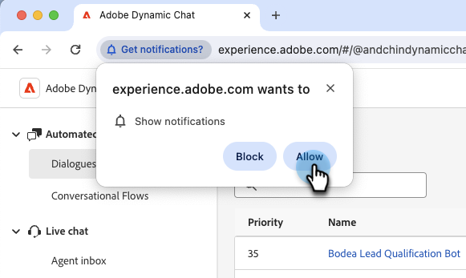

# Notifiche {#notifications}

Per ricevere le notifiche del browser per la chat in tempo reale, tutti gli agenti chat in tempo reale devono abilitare le notifiche del browser per Dynamic Chat quando richiesto.

Gli agenti di chat live visualizzeranno un banner nella parte superiore dello schermo quando effettuano l’accesso che recita &quot;Abilita le notifiche del browser per ricevere le notifiche di chat live&quot;. Fare clic su **Abilita**.

Agli agenti di chat live verrà quindi richiesto dal browser di visualizzare le notifiche. Fare clic su **Consenti**.

## Abilitare le notifiche in Chrome{#enable-notifications-in-chrome}

### Chrome per Windows

Google illustra i passaggi per abilitare le notifiche del browser per Windows in [questo articolo](https://support.mozilla.org/en-US/kb/push-notifications-firefox){target="_blank"}.

### Chrome per Mac OS

(Inserire qui i passaggi di John)

## Abilitare le notifiche in Firefox{#enable-notifications-in-firefox}

Firefox illustra i passaggi per varie versioni del browser e sistemi operativi in [questo articolo](https://support.mozilla.org/en-US/kb/push-notifications-firefox){target="_blank"}.

## Notifiche sistema operativo {#os-notifications}

Se gli agenti non ricevono ancora le notifiche dopo averle consentite nel browser, potrebbe essere necessario abilitare le notifiche per il browser nelle impostazioni di notifica del sistema operativo.

[Notifiche: Mac](https://support.apple.com/guide/mac-help/change-notifications-settings-mh40583/mac){target="_blank"}

[Notifiche: Windows](https://support.microsoft.com/en-us/windows/change-notification-settings-in-windows-8942c744-6198-fe56-4639-34320cf9444e){target="_blank"}

SI SONO MAI VERIFICATE NOTIFICHE DI AZIONI MSI???
