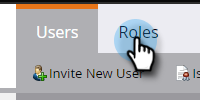

# Aggiungi o rimuovi utenti chat {#add-or-remove-chat-users}

Per aggiungere o rimuovere utenti chat, segui la procedura riportata di seguito.

>[!NOTE]
>
>Per impostazione predefinita, a tutti gli amministratori di Marketo Engage vengono concessi diritti di amministratore in Dynamic Chat.

## Aggiungi un utente di chat {#add-a-chat-user}

1. Accedi a [Adobe Admin Console](https://adminconsole.adobe.com/){target="_blank"}.

   

1. Fai clic su **[!UICONTROL Dynamic Chat]**.

   

   >[!NOTE]
   >
   >Se disponi di più di un abbonamento a Marketo, seleziona quello desiderato prima del passaggio successivo.

1. Fare clic sulla scheda **[!UICONTROL Users]**.

   

1. Fare clic sul pulsante **[!UICONTROL Add User]**.

   

1. Immettere [!UICONTROL name, user group, or email address] dell&#39;utente che si desidera aggiungere. Nome e cognome sono facoltativi.

   

1. Fai clic sull&#39;icona **+** e seleziona il profilo di prodotto desiderato.

   

1. Fai clic su **[!UICONTROL Save]**.

   

   >[!NOTE]
   >
   >Dopo aver aggiunto un utente nell’Admin Console di Adobe, la visualizzazione nella pagina Gestione agente di Dynamic Chat potrebbe richiedere fino a due ore.

## Aggiungi accesso Dynamic Chat al ruolo Marketo {#add-dynamic-chat-access-to-marketo-role}

Se il ruolo Marketo dell&#39;utente di Chat appena aggiunto non dispone già dell&#39;autorizzazione [!DNL Dynamic Chat], fare clic qui per aggiungerlo.

1. In Marketo, fare clic su **[!UICONTROL Admin]** e selezionare **[!UICONTROL Users & Roles]**.

   

1. Fare clic sulla scheda **[!UICONTROL Roles]**.

   

1. Dall&#39;elenco, selezionare il ruolo che si desidera modificare e fare clic su **[!UICONTROL Edit Role]**.

   

1. Selezionare **[!UICONTROL Access Dynamic Chat]** e fare clic su **[!UICONTROL Save]**.

   

## Rimuovere un utente di chat {#remove-a-chat-user}

1. Accedi a [Adobe Admin Console](https://adminconsole.adobe.com/){target="_blank"}.

   

1. Fai clic su **[!UICONTROL Dynamic Chat]**.

   

   >[!NOTE]
   >
   >Se disponi di più di un abbonamento a Marketo, seleziona quello desiderato prima del passaggio successivo.

1. Fare clic sulla scheda **[!UICONTROL Users]**.

   

1. Selezionare l&#39;utente che si desidera rimuovere.

   

1. Fare clic sul pulsante **[!UICONTROL Remove User]**.

   

1. Fai clic su **[!UICONTROL Remove User]** per confermare.

   

>[!MORELIKETHIS]
>
>* [Utenti Adobe Admin Console](https://helpx.adobe.com/it/enterprise/using/users.html){target="_blank"}
>* [Gestione Singola Utenti](https://helpx.adobe.com/it/enterprise/using/manage-users-individually.html){target="_blank"}
