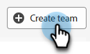

# Gestione agente {#agent-management}

In Gestione agenti, visualizza un elenco di agenti nell’istanza di Dynamic Chat, gestisci i team e imposta le regole di fallback.

## Agenti {#agents}

Questa scheda elenca tutti gli agenti nell’istanza di Dynamic Chat e include informazioni quali nome, indirizzo e-mail, stato della chat in tempo reale e altro ancora.

## Team {#teams}

Gli amministratori possono creare team di agenti per facilitare l’inoltro a gruppi specifici di agenti di vendita.

### Creare un team {#create-a-team}

1. Clic **+ Crea team**.

   

1. Dai un nome alla tua squadra.

   

1. Fai clic su **Aggiungi agenti** e selezionare gli agenti desiderati.

   

1. Fai clic su **Crea**.

   

## Regole di fallback {#fallback-rules}

### Fallback riunione {#meeting-fallback}

Selezionare un messaggio standard (di sistema) o scriverne uno personalizzato che i visitatori possano visualizzare quando la prenotazione della riunione non è disponibile.

### Fallback chat in diretta {#live-chat-fallback}

Seleziona un messaggio standard (di sistema) o scrivine uno personalizzato che i visitatori visualizzino quando la chat in diretta non è disponibile.

>[!NOTE]
>
>Selezione del **Includi opzione di prenotazione riunione** la casella di controllo consente al visitatore della chat di prenotare una riunione quando non sono disponibili agenti per la chat in diretta.

>[!TIP]
>
>Durante la creazione di un messaggio personalizzato, puoi applicare uno stile al font, utilizzare i collegamenti e persino inserire emoji. `:)`
