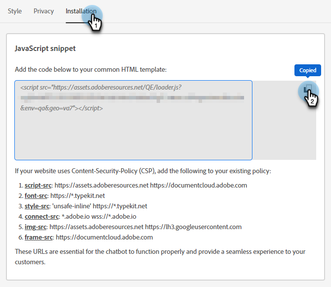

# Configurazione {#configuration}

Scopri come personalizzare l’aspetto della finestra di dialogo del chatbot.

Per iniziare, fai clic su **Chatbot** in **Configurazione**.

Sono disponibili diverse opzioni di personalizzazione.

## Scheda Stile {#style-tab}

### Stile {#style}

Qui puoi definire l’aspetto del chatbot in cui verranno visualizzate le finestre di dialogo, inclusi: colori, font, posizionamento del widget bot e nome/avatar del chatbot.

Il colore di ogni categoria è determinato da un valore [esadecimale del colore](https://color.adobe.com/create/color-wheel){target="_blank"} (ad esempio, bianco = #ffffff, rosso = #bf1932, ecc.).

L’ancoraggio consente al visitatore del sito di aprire/chiudere la chatbox. Puoi scegliere se visualizzare l’icona in basso a destra o in basso a sinistra. Puoi anche aumentare/ridurre la spaziatura interna (la quantità di spazio tra l’icona e la parte inferiore della pagina web).

### Impostazioni bot {#agent-settings}

In Impostazioni bot, puoi aggiungere alla chatbox un’etichetta (ad esempio, &quot;Assistente Adobe&quot;) che verrà visualizzata nella parte superiore. Puoi anche determinare il ritardo di risposta (in secondi) e modificare l’avatar della chat. Per caricare la tua immagine avatar, fai clic sul pulsante **+**.

>[!NOTE]
>
>Gli avatar personalizzati devono essere immagini quadrate inferiori a 256 kb e inferiori a 200x200 px. I tipi di file supportati sono: .jpg, .png, .gif, .webp, .svg.

**Suono notifica nuovo messaggio**

Fai clic sul menu a discesa per selezionare un suono per il visitatore ogni volta che il chatbot viene attivato in una sessione. È possibile scegliere tra più suoni.

**Abilita messaggi poke su dispositivi mobili**

Seleziona il cursore per abilitare &quot;Poke&quot; (Poke), che mostra la domanda di apertura accanto all’icona della chat senza che il visitatore debba fare clic su di essa per visualizzarla, per i visitatori che chattano da un dispositivo mobile.

>[!NOTE]
>
>Poke è disponibile solo nella prima [scheda](/help/marketo/product-docs/demand-generation/dynamic-chat/automated-chat/stream-designer.md#stream-designer-cards){target="_blank"} della conversazione.

Dopo aver apportato le modifiche, ricorda di fare clic su **Salva**.

## Scheda Privacy {#privacy-tab}

Fai clic sulla scheda **Privacy** per aggiungere/modificare l&#39;URL dell&#39;informativa sulla privacy del tuo sito (facoltativo).

## Scheda Installazione {#installation-tab}

Per far sì che il chatbot venga visualizzato sul sito web, devi innanzitutto installare lo snippet Dynamic Chat JavaScript. Fai clic su questa scheda per trovare/copiare il codice necessario. Se non conosci questa operazione, contatta il tuo team Web o il reparto IT per assistenza.

>[!TIP]
>
>Di seguito è riportato il codice da aggiungere se il sito utilizza Content-Security-Policy (CSP).

>[!NOTE]
>
>Il supporto Marketo non è configurato per fornire assistenza nella risoluzione dei problemi di HTML. Per assistenza su HTML, consulta uno sviluppatore web.
