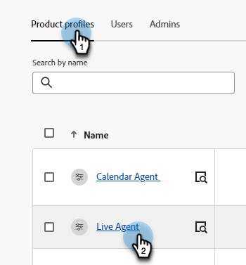

# Autorizzazioni {#permissions}

Sono disponibili cinque profili predefiniti con autorizzazioni predefinite che è possibile modificare in Dynamic Chat. Puoi anche creare un profilo personalizzato con un set personalizzato di autorizzazioni. Passiamo ad entrambi.

## Modifica autorizzazioni esistenti {#edit-existing-permissions}

1. In [Adobe Admin Console](https://adminconsole.adobe.com/){target="_blank"}, fai clic su **Dynamic Chat**.

   

1. In **Profili di prodotto** , selezionare il profilo da modificare. In questo esempio, stiamo scegliendo **Agente live**.

   

1. Fai clic su **Autorizzazioni** scheda.

   

1. Seleziona l’area del profilo da modificare. In questo esempio, scegliamo Live Chat. Fai clic sull’icona della matita.

   

1. Le autorizzazioni disponibili sono elencate a sinistra. Puoi scegliere di aggiungere le autorizzazioni una alla volta o tutte contemporaneamente. In questo esempio ne è disponibile solo uno, quindi stiamo aggiungendo quello. Fai clic su **+** firma.

   

   >[!NOTE]
   >
   >L’abilitazione dell’inclusione automatica aggiungerà tutte le autorizzazioni all’elenco incluso. Quando diventano disponibili nuovi elementi di autorizzazione, questi vengono automaticamente inclusi per quel profilo di prodotto.

1. Fai clic su **Salva**.

   

È ora possibile ripetere questa procedura per tutte le altre aree del Dynamic Chat.

## Creare un profilo {#create-a-profile}

1. In [Adobe Admin Console](https://adminconsole.adobe.com/){target="_blank"}, fai clic su **Dynamic Chat**.

   

1. In **Profili di prodotto** , fare clic su **Nuovo profilo**.

   

1. **Nome** profilo di prodotto. Facoltativamente, puoi assegnargli un nome visualizzato e/o una descrizione e scegliere di avvisare gli utenti quando vengono aggiunti/rimossi. Clic **Salva** al termine.

   

1. Il nuovo profilo verrà visualizzato nella scheda Profili di prodotto. Selezionala.

   

1. Ora seguire i punti 3-6 della [sezione precedente](#edit-existing-permissions) per ogni area desiderata.

## Elenco di autorizzazioni {#list-of-permissions}

Di seguito è riportato un elenco di tutte le autorizzazioni disponibili per ogni area.

<table>
<thead>
  <tr>
    <th style="width:30%">Area Dynamic Chat</th>
    <th>Autorizzazioni</th>
  </tr>
</thead>
<tbody>
  <tr>
    <td>Gestione conversazioni</td>
    <td><li>Visualizza finestre di dialogo</li>
    <li>Gestisci finestre di dialogo (crea, elimina)</li>
    <li>Finestre di dialogo di pubblicazione</li>
    <li>Visualizza flussi conversazionali</li>
    <li>Gestisci flussi conversazionali (crea, elimina)</li>
    <li>Pubblica flussi conversazionali</li></td>
  </tr>
  <tr>
    <td>Chat in tempo reale</td>
    <td><li>Visualizza conversazioni personali</li>
    <li>Visualizza tutte le conversazioni</li>
  </tr>
  <tr>
    <td>Riunioni</td>
    <td><li>Gestisci tutte le riunioni</li>
  </tr>
  <tr>
    <td>Analytics</td>
    <td><li>Visualizza i Report Prestazioni Globali</li>
    <li>Visualizzare i rapporti di chat in diretta</li>
    <li>Visualizza report riunioni</li>
    <li>Esporta rapporti</li></td>
  </tr>
  <tr>
    <td>Impostazioni agente</td>
    <td><li>Gestire la disponibilità della chat in tempo reale</li>
    <li>Connetti calendario</li>
    <li>Gestisci disponibilità calendario</li></td>
  </tr>
  <tr>
    <td>Impostazioni di amministrazione</td>
    <td><li>Visualizza round robin</li>
    <li>Visualizza regole personalizzate</li>
    <li>Gestire le regole personalizzate (aggiungere, modificare, eliminare)</li>
    <li>Visualizza elenco account <b>*</b></li>
    <li>Gestisci account (aggiungere, modificare, eliminare) <b>*</b></li>
    <li>Gestione impostazioni chatbot</li>
    <li>Gestione impostazioni flussi conversazionali</li>
    <li>Gestire privacy e sicurezza</li>
    <li>Gestire le integrazioni</li>
    <li>Gestisci agenti</li>
    <li>Visualizza team agenti <b>*</b></li>
    <li>Gestisci team agenti (aggiungere, modificare, eliminare) <b>*</b></li></td>
  </tr>
</tbody>
</table>

**&#42;** Attualmente disponibile solo per gli utenti di Dynamic Prime

## Autorizzazioni profilo predefinite {#default-profile-permissions}

Di seguito sono riportati i cinque profili predefiniti e le autorizzazioni abilitate per impostazione predefinita.

<table>
<thead>
  <tr>
    <th style="width:30%">Profilo</th>
    <th>Autorizzazioni predefinite</th>
  </tr>
</thead>
<tbody>
  <tr>
    <td>Utente marketing</td>
    <td><i>Gestione conversazioni</i>
    

    <li>Visualizza finestre di dialogo</li>
    <li>Gestisci finestre di dialogo (crea, elimina)</li>
    <li>Finestre di dialogo di pubblicazione</li>
    <li>Visualizza flussi conversazionali</li>
    <li>Gestisci flussi conversazionali (crea, elimina)</li>
    <li>Pubblica flussi conversazionali</li>
    

    
<i>Chat in tempo reale</i>

    <li>n/d</li>
    

    
<i>Riunioni</i>

    <li>n/d</li>
    

    
<i>Analytics</i>

    <li>Visualizza i Report Prestazioni Globali</li>
    <li>Visualizzare i rapporti di chat in diretta</li>
    <li>Visualizza report riunioni</li>
    

    
<i>Impostazioni agente</i>

    <li>n/d</li>
    

    
<i>Impostazioni di amministrazione</i>

    <li>Visualizza round robin</li>
    <li>Visualizza regole personalizzate</li>
    <li>Visualizza elenco account <b>*</b></li>
    <li>Visualizza team agenti <b>*</b></li>
    </td>
  </tr>
  <tr>
    <td><b>Agente live</b></td>
    <td><i>Gestione conversazioni</i>
    

    <li>Visualizza finestre di dialogo</li>
    <li>Visualizza flussi conversazionali</li>
    

    
<i>Chat in tempo reale</i>

    <li>Visualizza conversazioni personali</li>
    

    
<i>Riunioni</i>

    <li>n/d</li>
    

    
<i>Analytics</i>

    <li>Visualizza i Report Prestazioni Globali</li>
    <li>Visualizzare i rapporti di chat in diretta</li>
    <li>Visualizza report riunioni</li>
    

    
<i>Impostazioni agente</i>

    <li>Gestire la disponibilità della chat in tempo reale</li>
    <li>Connetti calendario</li>
    <li>Gestisci disponibilità calendario</li>
    

    
<i>Impostazioni di amministrazione</i>

    <li>Visualizza round robin</li>
    <li>Visualizza regole personalizzate</li>
    <li>Visualizza elenco account <b>*</b></li>
    <li>Visualizza team agenti <b>*</b></li>
    </td>
  </tr>
  <tr>
    <td><b>Agente calendario</b></td>
    <td><i>Gestione conversazioni</i>
    

    <li>Visualizza finestre di dialogo</li>
    <li>Visualizza flussi conversazionali</li>
    

    
<i>Chat in tempo reale</i>

    <li>n/d</li>
    

    
<i>Riunioni</i>

    <li>n/d</li>
    

    
<i>Analytics</i>

    <li>Visualizza i Report Prestazioni Globali</li>
    <li>Visualizzare i rapporti di chat in diretta</li>
    <li>Visualizza report riunioni</li>
    

    
<i>Impostazioni agente</i>

    <li>Connetti calendario</li>
    <li>Gestisci disponibilità calendario</li>
    

    
<i>Impostazioni di amministrazione</i>

    <li>Visualizza round robin</li>
    <li>Visualizza regole personalizzate</li>
    <li>Visualizza elenco account <b>*</b></li>
    <li>Visualizza team agenti <b>*</b></li>
    </td>
  </tr>
  <tr>
    <td><b>Amministratore marketing</b></td>
    <td><i>Gestione conversazioni</i>
    

    <li>Visualizza finestre di dialogo</li>
    <li>Gestisci finestre di dialogo (crea, elimina)</li>
    <li>Finestre di dialogo di pubblicazione</li>
    <li>Visualizza flussi conversazionali</li>
    <li>Gestisci flussi conversazionali (crea, elimina)</li>
    <li>Pubblica flussi conversazionali</li>
    

    
<i>Chat in tempo reale</i>

    <li>n/d</li>
    

    
<i>Riunioni</i>

    <li>n/d</li>
    

    
<i>Analytics</i>

    <li>Visualizza i Report Prestazioni Globali</li>
    <li>Visualizzare i rapporti di chat in diretta</li>
    <li>Visualizza report riunioni</li>
    <li>Esporta rapporti</li>
    

    
<i>Impostazioni agente</i>

    <li>n/d</li>
    

    
<i>Impostazioni di amministrazione</i>

    <li>Visualizza round robin</li>
    <li>Visualizza regole personalizzate</li>
    <li>Gestire le regole personalizzate (aggiungere, modificare, eliminare)</li>
    <li>Visualizza elenco account <b>*</b></li>
    <li>Gestisci account (aggiungere, modificare, eliminare) <b>*</b></li>
    <li>Gestione impostazioni chatbot</li>
    <li>Gestione impostazioni flussi conversazionali</li>
    <li>Gestire privacy e sicurezza</li>
    <li>Gestire le integrazioni</li>
    <li>Visualizza team agenti <b>*</b></li>
    </td>
  </tr>
  <tr>
    <td><b>Amministratore vendite</b></td>
    <td><i>Gestione conversazioni</i>
    

    <li>Visualizza finestre di dialogo</li>
    <li>Visualizza flussi conversazionali</li>
    

    
<i>Chat in tempo reale</i>

    <li>Visualizza conversazioni personali</li>
    <li>Visualizza tutte le conversazioni</li>
    

    
<i>Riunioni</i>

    <li>Gestisci tutte le riunioni</li>
    

    
<i>Analytics</i>

    <li>Visualizza i Report Prestazioni Globali</li>
    <li>Visualizzare i rapporti di chat in diretta</li>
    <li>Visualizza report riunioni</li>
    <li>Esporta rapporti</li>
    

    
<i>Impostazioni agente</i>

    <li>Gestire la disponibilità della chat in tempo reale</li>
    <li>Connetti calendario</li>
    <li>Gestisci disponibilità calendario</li>
    

    
<i>Impostazioni di amministrazione</i>

    <li>Visualizza round robin</li>
    <li>Visualizza regole personalizzate</li>
    <li>Gestire le regole personalizzate (aggiungere, modificare, eliminare)</li>
    <li>Visualizza elenco account <b>*</b></li>
    <li>Gestisci account (aggiungere, modificare, eliminare) <b>*</b></li>
    <li>Gestisci agenti</li>
    <li>Visualizza team agenti <b>*</b></li>
    <li>Gestisci team agenti <b>*</b></li>
    </td>
  </tr>
</tbody>
</table>

**&#42;** Attualmente disponibile solo per gli utenti di Dynamic Prime
