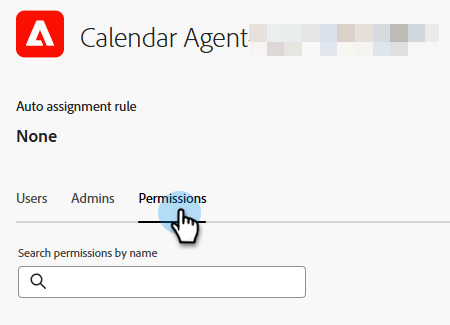

# Indirizzamento {#routing}

Le riunioni prenotate in Dynamic Chat possono essere instradate in due modi. Round robin o utilizzo di una regola personalizzata.

Round robin: le riunioni vengono assegnate agli agenti in sequenza. Quindi se hai cinque agenti e l&#39;agente tre ha preso l&#39;ultima riunione, l&#39;agente quattro prenderà la prossima, seguita dall&#39;agente cinque, e poi di nuovo dall&#39;agente uno.

Regola personalizzata: è possibile scegliere agenti specifici per ricevere riunioni in base agli attributi selezionati.

>[!NOTE]
>
>All’Instradamento dell’account viene assegnata la priorità più elevata. Quando un visitatore raggiunge il punto della conversazione per prenotare una riunione o avviare una chat in tempo reale, [Instradamento account](#account-routing) viene controllato prima di prendere in considerazione altre opzioni di instradamento.

## Creare una regola personalizzata {#create-a-custom-rule}

In questo esempio invieremo tutte le riunioni dagli stati dedotti di CA, OR e WA all&#39;agente John.

1. In Configurazione fare clic su **Regole di routing**.

   

1. Per impostazione predefinita, viene aperta la scheda **Regole personalizzate**.

   

1. Fai clic su **Crea regola**.

   

1. Denomina la regola. Facoltativamente, puoi aggiungere una descrizione e impostarne il livello di priorità. Fai clic su **Avanti**.

   

1. Scegli gli agenti desiderati.

   

1. Trascina sull’attributo o sugli attributi desiderati.

   

1. Trova e seleziona i valori desiderati.

   

1. Dopo aver selezionato tutti i valori desiderati, fare clic su **Salva**.

   

## Indirizzamento account {#account-routing}

Identifica e carica il tuo account di destinazione e i rispettivi proprietari delle vendite e indirizza i visitatori provenienti da tali account direttamente al rispettivo proprietario dell’account.

>[!PREREQUISITES]
>
>Prima che l&#39;instradamento dell&#39;account _Account_ sia visibile in Dynamic Chat, è necessario abilitare le autorizzazioni in Admin Console. Vedi [Abilita autorizzazioni](#enable-permissions) di seguito.

### Abilita autorizzazioni {#enable-permissions}

+++ Abilita autorizzazioni di indirizzamento degli account

1. Accedi a [https://adminconsole.adobe.com/](https://adminconsole.adobe.com/){target="_blank"}.

1. In _Prodotti_, seleziona **Dynamic Chat**.

   

1. In _Profili di prodotto_, selezionare il profilo desiderato.

   

1. Fare clic sulla scheda **Autorizzazioni**.

   

1. Fai clic sull&#39;icona Modifica () accanto a _Configurazione_.

   

1. Fai clic sul segno **+** accanto a _Visualizza indirizzamento account_.

   {width="600" zoomable="yes"}

1. Al termine, fai clic su **Salva**.

+++

### Aggiungi un account {#add-an-account}

In questo esempio, indirizzeremo tutti i dipendenti della Lego direttamente all&#39;agente Steven.

1. Nella scheda Instradamento account, fare clic su **+ Aggiungi account**.

   

   >[!TIP]
   >
   >Puoi creare più account contemporaneamente facendo clic su **Carica elenco account** e caricando un file CSV.

1. Immetti il nome della società, il dominio e seleziona l’agente desiderato.

   
