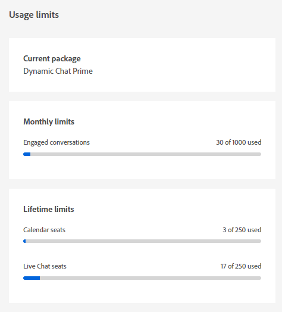

# Limiti di utilizzo {#usage-limits}

Visita la pagina Limiti di utilizzo per visualizzare informazioni importanti, ad esempio le informazioni sul pacchetto e lo stato del limite di utilizzo.

1. In Configurazione fare clic su **[!UICONTROL Limiti di utilizzo]**.

   

1. Visualizza il pacchetto corrente, lo stato del limite mensile per le conversazioni in corso e lo stato del limite della durata per le postazioni Calendario/Chat in diretta.

   

>[!NOTE]
>
>I limiti mensili vengono reimpostati automaticamente il 1° di ogni mese.
