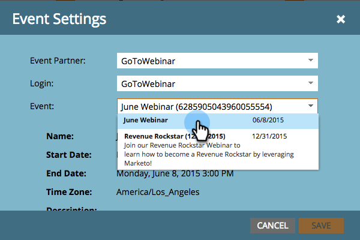

# Creare un evento con il webinar Goto {#create-an-event-with-gotowebinar}

>[!PREREQUISITES]
>
>* [Aggiungere GoToWebinar come servizio LaunchPoint](/help/marketo/product-docs/administration/additional-integrations/add-gotowebinar-as-a-launchpoint-service.md)
>* [Creare un nuovo programma evento](/help/marketo/product-docs/demand-generation/events/understanding-events/create-a-new-event-program.md)
>* Impostare il [azioni di flusso](/help/marketo/product-docs/core-marketo-concepts/smart-campaigns/flow-actions/add-a-flow-step-to-a-smart-campaign.md)per tenere traccia del coinvolgimento

Crea il webinar in GoToWebinar. Alcune impostazioni nella creazione del webinar GoToVengono utilizzate da Marketo, mentre altre vengono utilizzate solo da GoToWebinar.

Dopo aver creato un evento Marketo e aver associato ad esso il webinar GoTo, i sistemi saranno in grado di condividere le informazioni sulla registrazione e sulla partecipazione.

Di seguito è riportato un elenco delle impostazioni utilizzate da Marketo.

## Titolo e descrizione {#title-and-description}

**Nome webinar** - immetti il nome del webinar. Questo nome sarà visualizzabile in Marketo.

**Descrizione** (facoltativo) - inserisci la descrizione del webinar. La descrizione sarà visibile in Marketo.

## Data e ora {#date-time}

Immetti le seguenti informazioni per il webinar, che verranno inserite in Marketo tramite l’adattatore. Se si apportano modifiche a queste informazioni, è necessario fare clic sul collegamento &quot;**Aggiorna dal provider del webinar**&quot; sotto **Azioni evento**, affinché Marketo possa visualizzare le modifiche.

**Data di inizio** - inserire la data di inizio. Questo sarà visibile in Marketo.

**Ora di inizio** - immettere l&#39;ora di inizio. Questo sarà visibile in Marketo.

**Ora di fine** - inserisci l&#39;ora di fine. Questo sarà visibile in Marketo.

**Fuso orario** - selezionare il fuso orario applicabile. Sarà visualizzabile in Marketo.

**Tipo -** imposta su **Una sessione**.

>[!NOTE]
>
>Al momento Marketo non supporta i webinar ricorrenti. Devi impostare una singola sessione tra ogni evento Marketo e webinar GoToWebinar.

>[!TIP]
>
>Se hai bisogno di ulteriore aiuto per il webinar, visita il [Sito della Guida](https://support.logmeininc.com/gotowebinar).

Ora, saltiamo su Marketo!

1. Seleziona un evento. Clic **Azioni evento** e scegli **Impostazioni evento**.

   

   >[!NOTE]
   >
   >Il tipo di canale dell’evento selezionato deve essere **webinar**.

1. Scegli **Webinar GoTo** dal **Partner evento** Elenco.

   

1. Scegli l’account.

   

1. Seleziona il webinar.

   

1. Clic **Salva**.

   

1. Eccellente! Ora l’evento viene sincronizzato e pianificato da **Webinar GoTo**.

   

   >[!NOTE]
   >
   >I campi inviati da Marketo sono: Nome, Cognome, Indirizzo e-mail. Questi campi sono obbligatori e non devono essere vuoti.

   >[!TIP]
   >
   >Per compilare l’e-mail di conferma con questo URL univoco, utilizza il seguente token nell’e-mail: `{{member.webinar url}}`. Quando l’URL di conferma viene inviato, questo token viene automaticamente risolto nell’URL di conferma univoco della persona.
   >
   >Imposta l’e-mail di conferma su **Operativo** per garantire che le persone che si registrano e potrebbero annullare l’abbonamento ricevano comunque le informazioni di conferma.

   

   >[!CAUTION]
   >
   >Evita di utilizzare programmi e-mail nidificati per inviare le e-mail di conferma. Utilizza invece la campagna intelligente del programma dell’evento, come illustrato in precedenza.

   >[!TIP]
   >
   >La visualizzazione dei dati in Marketo può richiedere fino a 48 ore. Se dopo aver atteso a lungo non vedi ancora nulla, seleziona **Aggiorna dal provider del webinar** dal menu Azioni evento nel **Riepilogo** dell’evento.

Le persone che si registrano al webinar verranno inviate al provider del webinar tramite il passaggio del flusso di stato del programma di modifica quando il nuovo stato è impostato su &quot;Registrato&quot;. Nessun altro stato spingerà la persona oltre. Inoltre, assicurati di #1 il passaggio di flusso Stato programma di modifica e il passaggio di flusso Invia e-mail #2.

## Visualizzazione dello Schedule  {#viewing-the-schedule}

Nella visualizzazione della pianificazione del programma fare clic sulla voce del calendario dell&#39;evento. Il programma è visibile sul lato destro dello schermo.

>[!NOTE]
>
>Per modificare la pianificazione degli eventi, devi modificare il webinar su GoToWebinar.

