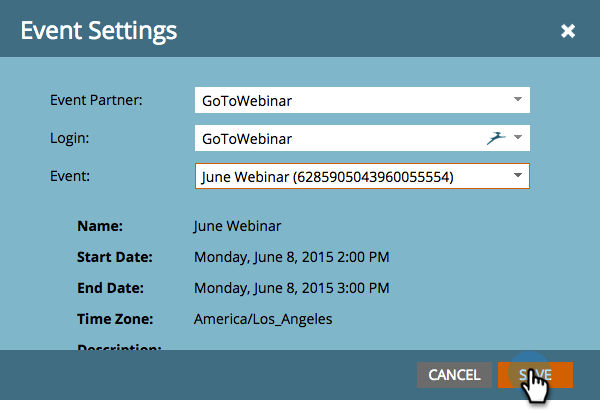

# Creazione di un evento con GotoWebinar {#create-an-event-with-gotowebinar}

>[!PREREQUISITES]
>
>* [Aggiungi GoToWebinar come servizio LaunchPoint](/help/marketo/product-docs/administration/additional-integrations/add-gotowebinar-as-a-launchpoint-service.md)
>* [Creare un nuovo programma evento](/help/marketo/product-docs/demand-generation/events/understanding-events/create-a-new-event-program.md)
>* Impostare le azioni di flusso [appropriate](http://docs.marketo.com/display/DOCS/Flow+Actions)per tenere traccia del coinvolgimento

Create innanzitutto il webinar in GoToWebinar. Alcune impostazioni nella creazione del GoToWebinar vengono utilizzate da Marketo e alcune sono utilizzate solo da GoToWebinar.

Dopo aver creato un evento Marketo e associato il GoToWebinar, i sistemi saranno in grado di condividere le informazioni di registrazione e partecipazione. Per informazioni sulla creazione di un GoToWebinar, consultate la [Guida utente GoToWebinar](http://docs.marketo.com/display/docs/assets/gotowebinar-user-guide.pdf).

Di seguito è riportato un elenco delle impostazioni utilizzate da Marketo.

## Titolo e descrizione {#title-and-description}

**Nome**  webinar: immettete il nome per il webinar. Questo nome sarà visibile in Marketo.

**Descrizione**  (facoltativo) - immettete la descrizione del webinar. La descrizione sarà`visibile in Marketo.

## Data e ora {#date-time}

`Enter the following information for your webinar and it will be pulled into Marketo via the`adattatore. Se apporti modifiche a tali informazioni, fai clic sul collegamento &quot;**Aggiorna da provider webinar**&quot; in **Azioni evento**, per consentire a Marketo di visualizzare le modifiche.

**Data**  di inizio: immetti la data di inizio. Questo sarà visibile in Marketo.

**Ora**  di inizio - Inserisci l&#39;ora di inizio. Questo sarà visibile in Marketo.

**Ora**  di fine - Inserisci l&#39;ora di fine. Questo sarà visibile in Marketo.

**Fuso**  orario: selezionate il fuso orario applicabile. Sarà visibile in Marketo.

**Digitare -** set su  **Una sessione**.

>[!NOTE]
>
>Marketo non supporta attualmente seminari Web ricorrenti. È necessario impostare una singola sessione tra ciascun seminario Web Marketo Event e GoToWebinar.

>[!TIP]
>
>In GoToWebinar sono disponibili altri campi che NON influiscono sull’integrazione. Fare riferimento alla [Guida utente GoToWebinar](http://docs.marketo.com/display/docs/assets/gotowebinar-user-guide.pdf) per ulteriori informazioni su tali campi, in quanto non saranno trattati in questo articolo. Se hai bisogno di ulteriore aiuto per GoToWebinar, visita il [sito della Guida](http://support.logmeininc.com/gotowebinar).

Ora, saltiamo su Marketo!

1. Selezionate un evento. Fare clic su **Azioni evento** e scegliere **Impostazioni evento**.

   

   >[!NOTE]
   >
   >Il tipo di canale dell&#39;evento selezionato deve essere **webinar**.

1. Scegliete **GoToWebinar** dall&#39;elenco **Event** **Partner**.

   

1. Scegliete l’account.

   

1. Selezionate il webinar.

   

1. Fare clic su **Salva**.

   

1. Eccellente! Ora l&#39;evento è sincronizzato e pianificato da **GoToWebinar**.

   

   >[!NOTE]
   >
   >I campi inviati da Marketo sono: Nome, Cognome, Indirizzo E-Mail. Questi campi sono obbligatori e non devono essere vuoti.

   >[!TIP]
   >
   >Per compilare il messaggio e-mail di conferma con questo URL univoco, utilizzate il seguente token nel messaggio e-mail: `{{member.webinar url}}`. Quando l&#39;URL di conferma viene inviato, questo token viene automaticamente risolto nell&#39;URL di conferma univoco della persona.
   >
   >Impostate l&#39;e-mail di conferma su **Operativo** per assicurare che le persone che si sono registrate e che potrebbero essere annullate la sottoscrizione continuino a ricevere le informazioni di conferma.

   

   >[!CAUTION]
   >
   >Evitate di utilizzare programmi e-mail nidificati per inviare le e-mail di conferma. Utilizzate invece la campagna intelligente del programma dell&#39;evento, come mostrato sopra.

   >[!TIP]
   >
   >La visualizzazione dei dati in Marketo può richiedere fino a 48 ore. Se dopo aver aspettato troppo a lungo non viene visualizzato nulla, selezionate **Aggiorna da provider webinar** dal menu Azioni evento nella scheda **Riepilogo** dell&#39;evento.

Le persone che si iscrivono al webinar vengono inviate al provider del webinar tramite il passaggio Modifica stato programma quando il nuovo stato è impostato su &quot;Registrato&quot;. Nessun altro stato farà passare la persona. Inoltre, accertatevi che Modifica stato programma passi il passaggio 1 e Invia flusso e-mail il passaggio 2.

## Visualizzazione della pianificazione {#viewing-the-schedule}

Nella [vista programmazione programma](http://docs.marketo.com/display/docs/program+schedule+view), fare clic sulla voce del calendario relativa all&#39;evento. Potete visualizzare la pianificazione sul lato destro dello schermo.

>[!NOTE]
>
>Per modificare la pianificazione dell’evento, dovrete modificare il webinar in GoToWebinar.

