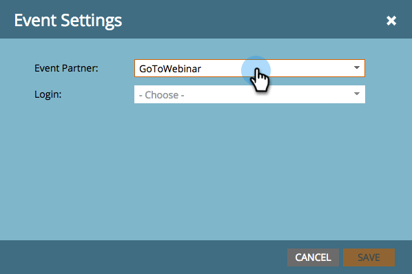

# Crea un evento con [!DNL GotoWebinar] {#create-an-event-with-gotowebinar}

>[!PREREQUISITES]
>
>* [Aggiungi [!DNL GoToWebinar] come  [!DNL LaunchPoint] servizio](/help/marketo/product-docs/administration/additional-integrations/add-gotowebinar-as-a-launchpoint-service.md)
>* [Crea un nuovo programma eventi](/help/marketo/product-docs/demand-generation/events/understanding-events/create-a-new-event-program.md)
>* Imposta le [azioni di flusso](/help/marketo/product-docs/core-marketo-concepts/smart-campaigns/flow-actions/add-a-flow-step-to-a-smart-campaign.md) appropriate per tenere traccia del coinvolgimento

Crea il tuo webinar in [!DNL GoToWebinar]. Alcune impostazioni nella creazione di [!DNL GoToWebinar] sono utilizzate da Marketo e altre solo da [!DNL GoToWebinar].

Dopo aver creato un evento Marketo e aver associato [!DNL GoToWebinar] a esso, i sistemi potranno condividere le informazioni di registrazione e partecipazione.

Di seguito è riportato un elenco delle impostazioni utilizzate da Marketo.

## Titolo e descrizione {#title-and-description}

**[!UICONTROL Title]** - immettere il nome del webinar. Questo nome sarà visualizzabile in Marketo.

**[!UICONTROL Description]** (facoltativo) - immettere la descrizione del webinar. La descrizione sarà visibile in Marketo.

## Data e ora {#date-time}

Immetti le seguenti informazioni per il webinar, che verranno inserite in Marketo tramite l’adattatore. Se si apportano modifiche a queste informazioni, è necessario fare clic sul collegamento &quot;**[!UICONTROL Refresh from Webinar Provider]**&quot; in **[!UICONTROL Event Actions]** per consentire a Marketo di visualizzare le modifiche.

**[!UICONTROL Start Date]** - immetti la data di inizio. Questo sarà visibile in Marketo.

**[!UICONTROL Start Time]** - immetti l&#39;ora di inizio. Questo sarà visibile in Marketo.

**[!UICONTROL End Time]** - immetti l&#39;ora di fine. Questo sarà visibile in Marketo.

**[!UICONTROL Webinar Time Zone]** - selezionare il fuso orario applicabile. Sarà visualizzabile in Marketo.

**[!UICONTROL Type]** - impostato su **[!UICONTROL One Session]**.

>[!NOTE]
>
>Al momento Marketo non supporta i webinar ricorrenti. È necessario impostare una singola sessione tra ogni evento Marketo e [!DNL GoToWebinar] webinar.

>[!TIP]
>
>Se hai bisogno di ulteriore assistenza su [!DNL GoToWebinar], visita il [sito della Guida](https://support.logmeininc.com/gotowebinar).

Ora, saltiamo su Marketo!

1. Seleziona un evento. Fare clic su **[!UICONTROL Event Actions]** e scegliere **[!UICONTROL Event Settings]**.

   

   >[!NOTE]
   >
   >Il tipo di canale dell&#39;evento selezionato deve essere **webinar**.

1. Scegliere **[!UICONTROL GoToWebinar]** dall&#39;elenco **[!UICONTROL Event Partner]**.

   

1. Scegli l’account.

   

1. Seleziona il webinar.

   

1. Fai clic su **[!UICONTROL Save]**.

   

1. Eccellente! Ora l&#39;evento è sincronizzato e pianificato da **[!DNL GoToWebinar]**.

   

   >[!NOTE]
   >
   >I campi inviati da Marketo sono: Nome, Cognome, Indirizzo e-mail. Questi campi sono obbligatori e non devono essere vuoti.

   >[!TIP]
   >
   >Per compilare l&#39;e-mail di conferma con questo URL univoco, utilizza il seguente token nell&#39;e-mail: `{{member.webinar url}}`. Quando l’URL di conferma viene inviato, questo token viene automaticamente risolto nell’URL di conferma univoco della persona.
   >
   >Imposta l&#39;e-mail di conferma su **Operativo** per garantire che le persone che si registrano e potrebbero annullare l&#39;iscrizione ricevano comunque le informazioni di conferma.

   

   >[!CAUTION]
   >
   >Evita di utilizzare programmi e-mail nidificati per inviare le e-mail di conferma. Utilizza invece la campagna intelligente del programma dell’evento, come illustrato in precedenza.

   >[!TIP]
   >
   >La visualizzazione dei dati in Marketo può richiedere fino a 48 ore. Se dopo aver atteso così a lungo non trovi ancora nulla, seleziona **[!UICONTROL Refresh from Webinar Provider]** dal menu [!UICONTROL Event Actions] nella scheda **[!UICONTROL Summary]** dell&#39;evento.

Le persone che si registrano al webinar verranno inviate al provider del webinar tramite il passaggio di flusso [!UICONTROL Change Program Status] quando [!UICONTROL New Status] è impostato su &quot;Registrato&quot;. Nessun altro stato spingerà la persona oltre. Assicurarsi inoltre di #1 [!UICONTROL Change Program Status] passaggio di flusso e #2. [!UICONTROL Send Email] passaggio di flusso

## Visualizzazione dello Schedule  {#viewing-the-schedule}

Nella visualizzazione della pianificazione del programma fare clic sulla voce del calendario dell&#39;evento. Il programma è visibile sul lato destro dello schermo.

>[!NOTE]
>
>Per cambiare la pianificazione dell&#39;evento, devi modificare il webinar il [!DNL GoToWebinar].

