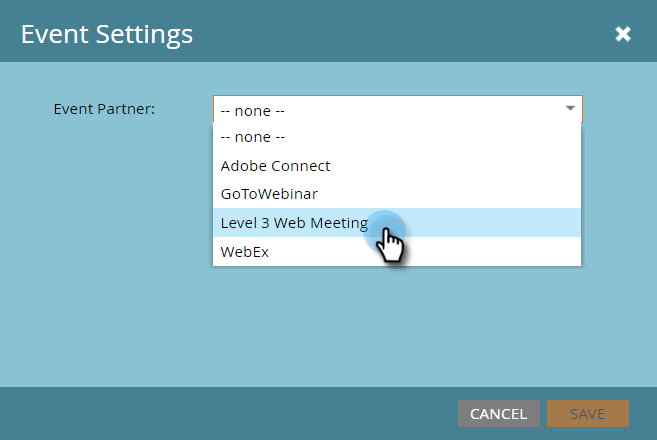

# Creare un evento con una riunione Web di livello 3 {#create-an-event-with-level-web-meeting}

>[!PREREQUISITES]
>
>* [Aggiungere una riunione Web di livello 3 come servizio LaunchPoint](/help/marketo/product-docs/administration/additional-integrations/add-level-3-web-meeting-as-a-launchpoint-service.md)
>* [Creare un nuovo programma evento](/help/marketo/product-docs/demand-generation/events/understanding-events/create-a-new-event-program.md)
>* Impostare il [azioni di flusso](/help/marketo/product-docs/core-marketo-concepts/smart-campaigns/flow-actions/add-a-flow-step-to-a-smart-campaign.md)per tenere traccia del coinvolgimento

Crea il webinar nel livello 3. Se hai bisogno di aiuto, consulta [Libreria risorse di livello 3](https://www.level3.com/en/resource-library/). Troverete che è molto simile a BrightTalk.  Marketo utilizza un piccolo sottoinsieme di campi di livello 3:

* **Nome** : nome del webcast.
* **Data di inizio** - La data di inizio del webcast.
* **Data di fine** - La data di fine del webcast.
* **Fuso orario** - Fuso orario impostato per il webcast.
* **Descrizione** : descrizione del webcast.

1. Seleziona il nuovo evento. Clic **Azioni evento,** allora **Impostazioni evento.**

   

1. In Partner evento, seleziona **Riunione Web livello 3**.

   

1. In Login, seleziona il livello 3 di accesso.

   

1. In Evento scegliere l&#39;evento di livello 3 che si desidera utilizzare.

   

1. Clic **Salva**.

   

   Ottimo! Hai collegato il tuo evento al livello 3.

## Visualizzazione dello Schedule  {#viewing-the-schedule}

Nella visualizzazione della pianificazione del programma fare clic sulla voce del calendario dell&#39;evento. Il programma è visibile sul lato destro dello schermo!

