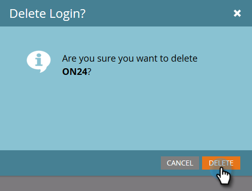

# Immettere le credenziali ON24 in Marketo {#enter-your-on-credentials-in-marketo}

Informazioni introduttive sull&#39;integrazione degli eventi ON24. Se devi modificare o eliminare le credenziali, questi passaggi sono inclusi anche qui di seguito.

## Immettere le credenziali {#enter-credentials}

1. Accedete a Marketo e fate clic su **Admin**.

   

1. In Integrazione, fare clic su **LaunchPoint**.

   

1. In Servizi installati, fare clic su **Nuovo**, quindi su **Nuovo servizio**.

   

1. Nella finestra di dialogo Nuovo servizio, immettete le informazioni seguenti:

   * **Nome**  visualizzato - Immettete un nome da usare in Marketo. Questo può essere il vostro nome o il nome del gruppo se condividete le credenziali.
   * **Servizio**  - Selezionate  **On24** dal menu a discesa.
   * **Chiave**  client - Immettere la chiave client ON24 utilizzata per l&#39;accesso. La chiave client è una stringa di 32 cifre contenente una combinazione di lettere e numeri.
   * **ID**  client - Immettete l&#39;ID client ON24 di 4 cifre che utilizzate per l&#39;accesso. Potete ottenere l&#39;ID client e la chiave client direttamente dal vostro Account Manager ON24.

   

1. Fare clic su **Crea**.

   

1. Una volta convalidate, le credenziali vengono aggiunte alla pagina Servizi installati. In caso di errore, non sarà possibile salvare le credenziali.

## Modifica credenziali {#edit-credentials}

È possibile modificare le credenziali se la password scade o se è necessario apportare una modifica a una credenziale esistente.

1. Nella scheda Servizi installati, selezionare la credenziale da modificare e fare clic su **Edit Service**.

   

1. Aggiornate le informazioni nella finestra di dialogo Modifica servizio e fate clic su **Salva**.

   

## Eliminare un servizio {#delete-a-service}

1. Nella scheda Servizi installati, selezionare il servizio che si desidera eliminare, fare clic sul menu a discesa **Azioni servizi** e selezionare **Elimina servizio**.

   

1. Fare clic su **Elimina**.

   

Il passaggio successivo consiste nel [creare l&#39;evento del seminario Web in ON24](/help/marketo/product-docs/demand-generation/events/create-an-event/create-an-event-with-the-marketo-on24-adapter/create-your-webinar-event-in-on24.md).

>[!MORELIKETHIS]
>
>[Informazioni sugli eventi dell&#39;adattatore Marketo ON24](/help/marketo/product-docs/demand-generation/events/create-an-event/create-an-event-with-the-marketo-on24-adapter/understanding-marketo-on24-adapter-events.md)
