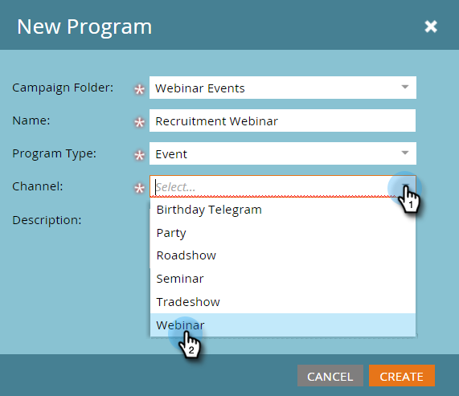

# Esempio di integrazione di eventi ON24 {#example-on-event-integration}

>[!IMPORTANT]
>
>A partire da agosto 2022, ON24 non supporta più nuove integrazioni Marketo. Le informazioni contenute in questo articolo si applicano solo agli utenti esistenti.

Ecco un evento di esempio, campagne incluse, per un webinar ON24. Quando crei l’evento, assicurati di testare le campagne prima di eseguirle.

## Creare un nuovo evento nelle attività di marketing {#create-a-new-event-in-marketing-activities}

1. Seleziona **Nuovo** > **Nuovo programma**.

   

1. Seleziona una **Cartella campagna** dove sarà live l&#39;evento.

   

1. Inserisci un **Nome** per l&#39;evento.

   

1. Seleziona **Evento** come **Tipo di programma**.

   

1. Seleziona **Webinar** come **Canale** per l&#39;evento.

   

1. Fai clic su **Crea**.

   

## Invita (campagna batch)  {#invite-batch-campaign}

* **Elenco avanzato** - Definisci chi inviti all’evento.
* **Flusso**

   * Invia e-mail : se si tratta di un’e-mail di risorsa locale, avrà la seguente convenzione di denominazione: EventName.EmailName. Puoi anche utilizzare le e-mail globali.
   * Cambia stato in progressione - Imposta su Webinar > Invitato.

* **Pianificazione** - Imposta la data dell&#39;invito da inviare.

## Registrazione/conferma (Trigger Campaign) {#registration-confirmation-trigger-campaign}

* **Elenco avanzato**

   * Attiva la campagna in base a **Riempie il modulo**. Accertati di includere la pagina di destinazione in cui si trova il modulo utilizzando **Aggiungi vincolo**, soprattutto se il modulo viene utilizzato su più pagine di destinazione.

>[!CAUTION]
>
>È necessario utilizzare un modulo Marketo per registrare le persone per l’evento, o un modulo non Marketo con l’integrazione API corretta per inviare i dati di registrazione push a Marketo. Questo è fondamentale per il successo dell’integrazione Event Partner. **NOTA**: Se utilizzi un modulo Marketo su una pagina di destinazione non Marketo, il trigger sarà **Riempie il modulo** con il nome del modulo.

* **Flusso**

   * **Cambia stato in progressione** - Imposta su Webinar > Registrato. **ATTENZIONE**: Questo passaggio di flusso è necessario quando si imposta la campagna figlio. Quando lo stato di avanzamento di una persona cambia in **Registrato**, Marketo invia le informazioni di registrazione a ON24.

   * **Invia e-mail** - Messaggio e-mail di conferma (impostato su **Operativo** in modo che le persone non abbonate che si sono registrate lo ricevano ancora).

**NOTA**: Se la persona viene restituita con un errore di registrazione, non riceverà la conferma via e-mail.

## Promemoria (campagna batch) {#reminder-batch-campaign}

* **Elenco avanzato** - Filtro con **Membro del programma** e imposta lo stato su **Registrato**.

* **Flusso** - Invia e-mail (Promemoria E-Mail).

**NOTA**: Puoi utilizzare una campagna simile per inviare un *diverso* e-mail di follow-up alle persone invitate ma non ancora registrate.

## Campagna di follow-up (campagna batch o trigger) {#follow-up-campaign-batch-or-trigger-campaign}

* **Elenco avanzato** - Trigger in base alle modifiche allo stato del programma.

* **Flusso** - Invia e-mail. Utilizza le opzioni per inviare e-mail diverse in base allo stato del programma.

>[!MORELIKETHIS]
>
>[Informazioni sugli eventi dell&#39;adattatore Marketo ON24](/help/marketo/product-docs/demand-generation/events/create-an-event/create-an-event-with-the-marketo-on24-adapter/understanding-marketo-on24-adapter-events.md)
