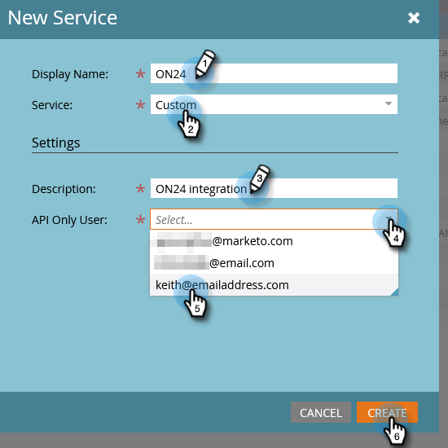

# Configurare l&#39;integrazione ON24 con Marketo{#set-up-the-on24-integration-with-marketo}

Ecco come impostare l’integrazione degli eventi ON24.

## Creare un ruolo solo API {#create-an-api-only-role}

1. Dal mio Marketo, fai clic su **Amministratore**.

   

1. In Sicurezza, fai clic su **Utenti e ruoli**.

   

1. Fai clic sul pulsante **Ruoli** e quindi **Nuovo ruolo**.

   

1. Immetti un Nome ruolo. Apri **API di accesso** e selezionare &quot;Read-Write Custom Object&quot; e &quot;Read-Write Person&quot;. Fai clic su **Crea**.

   

## Creare un nuovo utente {#create-a-new-user}

1. Sempre in Utenti e ruoli, fai clic sul pulsante **Utenti** e fai clic su **Invita nuovo utente**.

   

1. Immetti le informazioni del nuovo utente e fai clic su **Successivo**.

   

1. Seleziona il ruolo Solo API ON24 appena creato. Seleziona la **Solo API** casella di controllo. Fai clic su **Successivo**.

   

1. Fai clic su **Invia**.

   

>[!NOTE]
>
>Un invito non è richiesto per gli utenti solo API.

## Configurazione connessione ON24 {#set-up-on24-connection}

1. Sempre nella sezione Amministratore, fai clic su **LaunchPoint**.

   

1. Fai clic su **Nuovo** then **Nuovo servizio**.

   

1. Scegli un nome visualizzato. Fai clic sul pulsante **Servizio** a discesa e seleziona **Personalizzato**. Immetti una descrizione. Fai clic sull’elenco a discesa Solo utente API e seleziona l’utente creato [nei passaggi precedenti](#create-a-new-user). Fai clic su **Crea**.

   

1. Individua il servizio LaunchPoint personalizzato appena creato e fai clic su Visualizza dettagli.

   

1. Evidenzia, fai clic con il pulsante destro del mouse, copia e salva l’ID client (ne avrai bisogno in un secondo momento). Ripeti per segreto client.

   

1. Nella struttura a sinistra fare clic su Servizi Web.

   

1. In &quot;REST API&quot;, evidenzia, fai clic con il pulsante destro del mouse, copia e salva la prima parte dell’identità (fino a &quot;m&quot; in .com).

   

1. Con l’ID client, il segreto client e l’identità salvati, accedi al tuo account ON24. Gli altri passaggi vengono eseguiti e [delineato qui](https://on24support.force.com/Support/s/article/Connect-Marketo-ON24-Connect-Data-Integration#Step6){target=&quot;_blank&quot;}.
