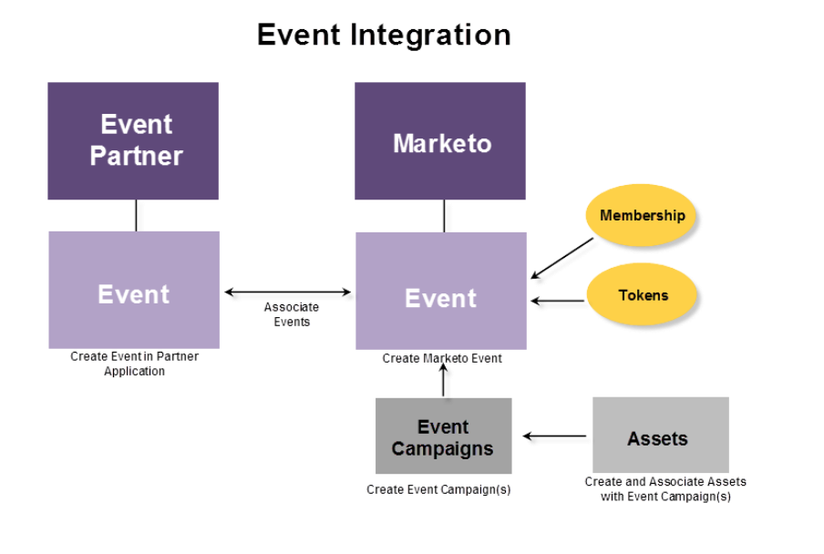

# Informazioni sugli eventi con adattatore ON24 Marketo {#understanding-marketo-on-adapter-events}

Se il webinar ON24 non è connesso a Marketo, è necessario prendere le informazioni sul partecipante già presenti in Marketo e inserirle in ON24. Dopo il webinar, devi prendere le informazioni sulla partecipazione già presenti in ON24 e immetterle nuovamente in Marketo.

La scheda di rete ON24 trasferisce automaticamente tutte le informazioni. Invia le informazioni di registrazione acquisite in una pagina di destinazione di Marketo a ON24 e richiama automaticamente le informazioni sulla partecipazione a un evento Marketo.

Questi articoli ti guideranno durante la creazione di un webinar in ON24, la creazione di un evento in Marketo e la loro associazione.

L’immagine seguente illustra il processo di integrazione.

Pronto per iniziare? Iniziare con [Creare un evento con la scheda ON24](/help/marketo/product-docs/demand-generation/events/create-an-event/create-an-event-with-the-marketo-on24-adapter.md){target="_blank"}.
