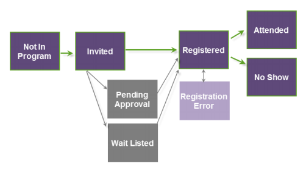

# Informazioni sugli stati del programma webinar {#understanding-webinar-program-statuses}

Gli stati del programma rappresentano i diversi stati dell&#39;evento che una persona compie come membro dell&#39;evento. Sono associati a un tipo di canale. Marketo ha un tipo di canale integrato denominato **Webinar**. Gli stati possono essere utilizzati sia nelle campagne batch che nelle campagne di attivazione.

Le persone passano attraverso gli stati dei programmi in modo lineare e non tornano nello stato. Ad esempio, una persona con uno stato di **Partecipato** non può tornare a **Registrato**.

Di seguito viene fornita una breve descrizione degli stati del programma associati al canale del webinar.

>[!TIP]
>
>Per aggiornare manualmente gli stati, fare clic su **Aggiorna da provider webinar** nel menu a discesa **Azioni evento**.

**Non in Program**  - Utilizzate questo stato per rimuovere le persone dall&#39;evento.

**Invitati**  - Utilizzate questo stato per aggiungere persone all&#39;evento.

**In attesa di approvazione**  - Utilizzate questo stato per sospendere l&#39;invio di un&#39;e-mail di conferma alla gente. Per ulteriori informazioni, vedere &quot;Approvazione manuale degli utenti registrati&quot; in [On24 Event Registration updates](/help/marketo/product-docs/demand-generation/events/create-an-event/create-an-event-with-the-marketo-on24-adapter/on24-event-registration-updates.md).

**Attendi in elenco**  - Utilizzate questo stato per mantenere alcune persone in attesa di ulteriori posti disponibili.

**Rifiutato**  - Utilizzate questo stato per rifiutare la registrazione di una persona all&#39;evento.

**Registrato** : questo stato spinge le persone a ON24 quando si utilizza l&#39;integrazione ON24. Lo stato della persona viene aggiornato quando ON24 risponde che la persona è stata registrata con successo.

**Errore**  di registrazione: questo stato riflette il fatto che l&#39;utente ha rilevato un errore durante il tentativo di registrazione all&#39;evento.

>[!NOTE]
>
>Se si verifica un errore di registrazione, è possibile ottenere informazioni aggiuntive per tale persona guardando la colonna Motivo stato nella scheda Membri del programma. Una volta corretto l’errore, potete modificare manualmente lo stato del programma dell’utente in Registrato in Marketo.

**Partecipante**  - Al termine del webinar, ON24 restituisce un elenco di persone che hanno partecipato. Questo stato viene inserito automaticamente in Marketo.

**Partecipazione on-demand** : le persone che hanno partecipato alla versione archiviata del webinar ricevono questo stato.

**No Show** - Al termine del webinar e dopo aver estratto i dati di partecipazione da ON24, lo stato delle persone che si sono registrate ma non hanno partecipato viene aggiornato a No Show. L&#39;ON24 può richiedere da 30 a 3 ore per preparare le informazioni di partecipazione finale e renderle disponibili a Marketo.

>[!NOTE]
>
>Affinché Marketo possa ottenere lo stato No Show, le persone devono essere state registrate *in Marketo*. Non è possibile acquisire No Show proveniente dal feed di dati On24.

>[!MORELIKETHIS]
>
>[Informazioni sugli eventi dell&#39;adattatore Marketo ON24](/help/marketo/product-docs/demand-generation/events/create-an-event/create-an-event-with-the-marketo-on24-adapter/understanding-marketo-on24-adapter-events.md)
