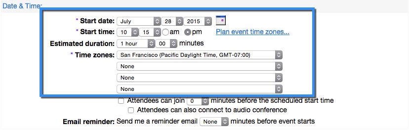
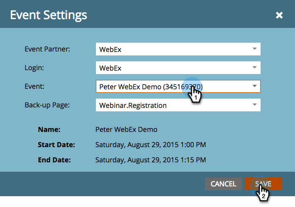

# Creare un evento con Webex {#create-an-event-with-webex}

>[!PREREQUISITES]
>
>* [Aggiungere Webex as a LaunchPoint Service](/help/marketo/product-docs/administration/additional-integrations/add-webex-as-a-launchpoint-service.md)
>* [Creare un nuovo programma evento](/help/marketo/product-docs/demand-generation/events/understanding-events/create-a-new-event-program.md)
>* Impostare il [azioni di flusso](/help/marketo/product-docs/core-marketo-concepts/smart-campaigns/flow-actions/add-a-flow-step-to-a-smart-campaign.md) per tenere traccia del coinvolgimento
>* Assicurati di utilizzare Eventi Webex (classico)

Creare innanzitutto un evento Webex nel Centro eventi Webex. Marketo utilizza solo impostazioni e campi specifici per la tua integrazione, che vedremo a breve. Gli altri campi che è possibile configurare per Webex sono illustrati nella [Guida utente del Centro eventi di Webex](https://www.cisco.com/c/dam/en/us/td/docs/collaboration/meeting_center/wbs298/wx_ec_host_ug.pdf).

>[!IMPORTANT]
>
>Il Marketo Engage supporta solo gli eventi creati in Eventi Webex (classico). Al momento, Marketo non supporta gli eventi creati negli eventi Webex (nuovi).

## Informazioni di base {#basic-information}

* **Nome evento -** Questo nome sarà visualizzabile in Marketo.
* **Casella di controllo non elencata**

   * Si consiglia di effettuare le seguenti operazioni **non** elenca l’evento. In questo modo tutte le persone si registreranno nella pagina di destinazione di Marketo. Le persone che si registrano tramite un meccanismo diverso da Marketo verranno mostrate in Marketo dopo la conclusione dell&#39;evento E solo se hanno partecipato all&#39;evento.
   * Se si sceglie di elencare l&#39;evento, questo verrà visualizzato nella pagina Elenco eventi per tutti gli utenti che visitano il sito Web del Centro eventi.

* **Registrazione -** Selezionare questa casella per impostare su &quot;obbligatorio&quot;. Utilizzerai un modulo/pagina di destinazione Marketo per acquisire le informazioni di registrazione che verranno inviate a Webex.
* **Password evento**- (facoltativo) Se utilizzi questo campo, assicurati di includerlo nell’e-mail di conferma!

## Data e ora {#date-time}

* **Data di inizio** - Inserire la data di inizio. Questo sarà visibile in Marketo.

* **Ora di inizio** - Immettere l&#39;ora di inizio. Questo sarà visibile in Marketo.

* **Durata stimata** - Specifica la durata dell’evento. Questo sarà visibile in Marketo.

* **Fusi orari** - Indicare i fusi orari applicabili. Saranno visualizzabili in Marketo.

## Impostazioni Audio Conference {#audio-conference-settings}

Queste impostazioni risiedono solo in Webex. Non sono utilizzati da o visualizzabili in Marketo, ma possono essere importanti per il webinar, quindi ricontrollateli!

## Descrizione evento e opzioni  {#event-description-options}

Le seguenti opzioni sono utilizzate da o visualizzabili in Marketo. Altri campi sono disponibili solo in Webex.

* **Descrizione** - Inserire una descrizione. Sarà visualizzabile ma non modificabile in Marketo.
* **Sondaggio post-evento** - Al momento, Marketo non è in grado di acquisire le informazioni relative a un sondaggio effettuato dopo l&#39;evento su Webex.
* **URL di destinazione** - (facoltativo) Puoi immettere l’URL di una pagina di destinazione Marketo da utilizzare come URL di destinazione da visualizzare al termine della sessione.

## Partecipanti e registrazione {#attendees-registration}

Controllerai l’elenco degli inviti, il modulo di registrazione e altre e-mail tramite un evento Marketo. Altre funzionalità non saranno supportate da Marketo, tra cui:

* **Numero massimo di iscritti** - Attualmente **non** supportato tramite l’integrazione Marketo-Webex.  L’approvazione manuale dei dichiaranti è disponibile utilizzando lo stato di progressione Approvazione in sospeso in Marketo.

* **ID registrazione richiesto** - Attualmente supportato tramite l&#39;integrazione Marketo-Webex. Puoi utilizzare Marketo per inviare l’e-mail di conferma per l’evento. Quando la persona si registra, riceve un URL univoco da utilizzare per inserire l’evento.

  >[!TIP]
  >
  >Per compilare l’e-mail di conferma con questo URL univoco, utilizza il seguente token nell’e-mail: `{{member.webinar url}}`. Quando l’URL di conferma viene inviato, questo token viene automaticamente risolto nell’URL di conferma univoco della persona.
  >
  >Imposta l’e-mail di conferma su **Operativo** per garantire che le persone che si registrano e potrebbero annullare l’abbonamento ricevano comunque le informazioni di conferma.

* **Password registrazione** - (Facoltativo) Attualmente non supportato utilizzando l&#39;integrazione Marketo-Webex.
* **Regole di approvazione** - Attualmente non supportato dall&#39;integrazione Marketo-Webex. Tuttavia, puoi utilizzare le campagne intelligenti in Marketo per controllare le approvazioni.

### Presentatori e membri del panel {#presenters-panelists}

Le informazioni configurate in questa sezione non vengono passate a Marketo.

### Messaggi e-mail {#email-messages}

Utilizzerai Marketo per inviare e-mail agli iscritti, e-mail di conferma, ecc. Non è necessario configurare alcun elemento in questa sezione. Disattiva (deseleziona) le opzioni dei messaggi e-mail in Webex.

>[!NOTE]
>
>L’integrazione Marketo-Webex non supporta l’invio di e-mail di conferma da Webex. La conferma deve essere inviata tramite Marketo. Dopo aver pianificato l’evento, copia le informazioni sull’evento nell’e-mail di conferma di Marketo e imposta l’indirizzo e-mail come **Operativo**.

Ora siamo pronti per entrare in Marketo!

1. Seleziona l’evento creato. Apri **Azioni evento** a discesa. Scegli **Impostazioni evento.**

   

   >[!NOTE]
   >
   >Il tipo di canale dell’evento selezionato deve essere **webinar**.

1. Sotto **Partner evento**, seleziona **Webex**.

   

1. Sotto **Login**, scegli il tuo login a Webex.

   

1. Sotto **Evento**, scegli il tuo evento Webex appena creato. Quindi, selezionare una pagina di backup facoltativa e fare clic su **Salva**.

   

1. Seleziona una pagina di backup opzionale per l’evento Webex. Scegli dall’elenco a discesa delle pagine di destinazione di Marketo approvate o immetti l’URL di una pagina di destinazione non Marketo.

   >[!TIP]
   >
   >Impostare una pagina di backup per indirizzare un membro a una pagina specifica se fa clic sul relativo URL evento personalizzato prima dell&#39;ora di inizio dell&#39;evento.

   >[!NOTE]
   >
   >I campi inviati da Marketo sono: Nome, Cognome, Indirizzo e-mail.

   

   >[!CAUTION]
   >
   >Evita di utilizzare programmi e-mail nidificati per inviare le e-mail di conferma. Utilizza invece la campagna intelligente del programma dell’evento, come illustrato in precedenza.

   >[!TIP]
   >
   >La visualizzazione dei dati in Marketo può richiedere fino a 48 ore. Se dopo aver atteso a lungo non vedi ancora nulla, seleziona **Aggiorna dal provider del webinar** dal menu Azioni evento nel **Riepilogo** dell’evento.

Dolce! Il tuo evento Webex è ora sincronizzato con il tuo evento Marketo. Le persone che si registrano al webinar verranno inviate al provider del webinar tramite il passaggio del flusso di stato del programma di modifica quando il nuovo stato è impostato su &quot;Registrato&quot;. Nessun altro stato spingerà la persona oltre. Inoltre, assicurati di #1 il passaggio di flusso Stato programma di modifica e il passaggio di flusso Invia e-mail #2.

## Visualizzazione dello Schedule  {#viewing-the-schedule}

Nella visualizzazione della pianificazione del programma fare clic sulla voce del calendario dell&#39;evento. Il programma è visibile sul lato destro dello schermo!

>[!NOTE]
>
>Per cambiare la pianificazione dell&#39;evento è necessario modificare il webinar su Webex.
