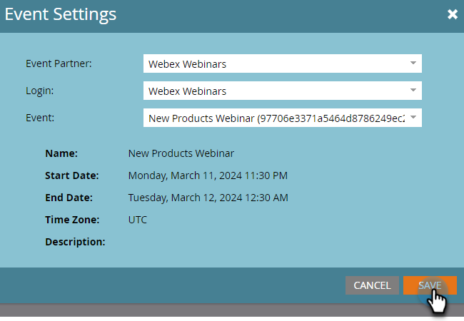

# Crea un evento con [!DNL Webex] {#create-an-event-with-webex}

Dopo aver creato un webinar in Webex, dovrai sincronizzare l’evento con Marketo Engage.

>[!PREREQUISITES]
>
>* [Aggiungi [!DNL Webex] come  [!DNL LaunchPoint] Servizio](/help/marketo/product-docs/administration/additional-integrations/add-webex-as-a-launchpoint-service.md)
>* [Crea un nuovo programma eventi](/help/marketo/product-docs/demand-generation/events/understanding-events/create-a-new-event-program.md)
>* Imposta le [azioni di flusso](/help/marketo/product-docs/core-marketo-concepts/smart-campaigns/flow-actions/add-a-flow-step-to-a-smart-campaign.md) appropriate per tenere traccia del coinvolgimento

## Pianificazione del webinar {#schedule-your-webinar}

Pianifica l&#39;evento e scegli le impostazioni preferite in [Webex](https://www.webex.com/){target="_blank"}. In Marketo sono visualizzabili solo le seguenti informazioni: nome del webinar, data e ora di inizio/fine, fuso orario e descrizione. Ulteriori informazioni sui webinar Webex [sono disponibili qui](https://help.webex.com/en-us/landing/ld-7srxjs-WebexWebinars/Webex-Webinars){target="_blank"}.

### Informazioni di base {#basic-information}

* **[!UICONTROL Event Name]-** Questo nome sarà visualizzabile in Marketo.
* **[!UICONTROL Unlisted Checkbox]**
* **Argomento**: questo è il nome dell&#39;evento e sarà visualizzabile in Marketo.
* **Data e ora**: in Marketo è possibile visualizzare data e ora di inizio/fine, ora di inizio/fine, durata e fuso orario.
* **Numero massimo partecipanti**: il numero massimo di partecipanti determina quali funzionalità Webex sono supportate.
* **Visualizzazione webcast per i partecipanti**: selezionare questa opzione per far sì che il webinar venga trasmesso in streaming a tutti i partecipanti.
* **Panelist**: invita persone specifiche a partecipare al webinar.
* **Agenda webinar**: compilalo se vuoi fornire il contesto nell&#39;invito e-mail inviato ai membri del collegio.

### Sicurezza {#security}

* **Password webinar**: (facoltativo) se utilizzi questo campo, assicurati di includerlo nell&#39;e-mail di conferma.
* **Password per il ruolo**: (facoltativo) se utilizzi questo campo, assicurati di includerlo nell&#39;agenda del webinar.
* **Richiedi account**: limita i partecipanti solo a coloro che dispongono di account Webex.

### Opzioni di connessione audio {#audio-connection-options}

* **Tipo di connessione audio**: scegli in che modo i partecipanti al webinar si uniscono alla porzione audio del webinar.
* **Tono di ingresso e di uscita**: selezionare il suono desiderato per gli utenti quando qualcuno entra o esce dal webinar (connessione audio telefonica richiesta).
* **Disattiva audio pannello**: scegli le impostazioni di disattivazione audio desiderate per il pannello.

### Opzioni avanzate {#advanced-options}

* **Registrazione automatica**: selezionare questa opzione per registrare automaticamente il webinar.
* **Sessione di esercitazione**: selezionare questa opzione per avviare una sessione di esercitazione all&#39;inizio del webinar.
* **Sessioni Breakout**: le sessioni Breakout consentono di preassegnare i membri del gruppo e i partecipanti prima dell&#39;inizio del webinar o di consentire loro di partecipare durante il webinar.
* **Serie di webinar**: l&#39;aggiunta a una serie di webinar consente alle persone di visualizzare il webinar, indipendentemente dal fatto che sia pubblico o meno.
* **Registrazione**: i partecipanti devono registrarsi e ricevere l&#39;approvazione dell&#39;host prima di partecipare.
* **Promemoria e-mail**: scegli un promemoria e-mail che vada da 15 minuti prima dell&#39;inizio del webinar fino a due giorni.
* **Opzioni webinar**: determina le funzionalità disponibili per i partecipanti al webinar.
* **Privilegi partecipanti**: i privilegi partecipanti determinano le azioni disponibili per i partecipanti al webinar.

>[!NOTE]
>
>L’integrazione Marketo-Webex non supporta l’invio di e-mail di conferma da Webex. La conferma deve essere inviata tramite Marketo. Dopo aver pianificato l&#39;evento, assicurati di copiare le informazioni sull&#39;evento nell&#39;e-mail di conferma di Marketo e impostare l&#39;e-mail come _Operativa_.

## Sincronizza l’evento con Marketo Engage {#sync-your-event-with-marketo-engage}

1. In Marketo, individua e seleziona il programma di eventi desiderato. Nel menu a discesa **Azioni evento**, seleziona **Impostazioni evento**.

   

   >[!NOTE]
   >
   >Il tipo di canale dell&#39;evento selezionato deve essere **webinar**.

1. Nel menu a discesa **Partner evento**, seleziona **Webinar Webex**.

   

1. Nel menu a discesa **Accesso**, scegli il tuo account di accesso Webex.

   

1. Nel menu a discesa **Evento**, scegli l&#39;evento Webex.

   

1. I dettagli del webinar verranno compilati. Fai clic su **Salva**.

   

L’evento Webex è ora sincronizzato con il programma Marketo Event. Le persone che si registrano al webinar verranno inviate al provider del webinar tramite il passaggio di flusso _Modifica stato programma_ quando il nuovo stato è impostato su &quot;Registrato&quot;. Nessun altro stato spingerà la persona oltre. Assicurati di #1 #2. il passaggio di flusso _Modifica stato programma_ e il passaggio di flusso _Invia e-mail_

## Aspetti da considerare {#things-to-note}

* Evita di utilizzare i programmi e-mail nidificati per inviare le e-mail di conferma. Al suo posto, utilizza la campagna avanzata del programma per eventi.

* La visualizzazione dei dati in Marketo può richiedere fino a 48 ore. Se dopo aver atteso così a lungo non trovi ancora nulla, fai clic su **Aggiorna dal provider di webinar** nell&#39;elenco a discesa **Azioni evento** nella scheda **Riepilogo** del programma eventi.
