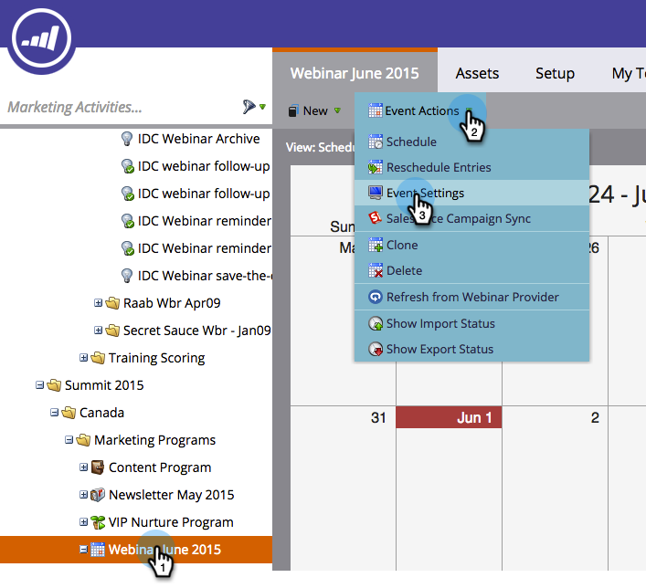

# Creazione di un evento con zoom {#create-an-event-with-zoom}

>[!PREREQUISITES]
>
>* [Aggiungi zoom come servizio LaunchPoint](/help/marketo/product-docs/administration/additional-integrations/add-zoom-as-a-launchpoint-service.md)
>* [Creare un nuovo programma evento](/help/marketo/product-docs/demand-generation/events/understanding-events/create-a-new-event-program.md)
>* Impostare le azioni di flusso [appropriate](/help/marketo/product-docs/core-marketo-concepts/smart-campaigns/flow-actions/add-a-flow-step-to-a-smart-campaign.md)per tenere traccia del coinvolgimento

Create innanzitutto il webinar in Zoom. Alcune impostazioni per la creazione dello zoom vengono utilizzate da Marketo, altre solo da Zoom.

Dopo aver creato un evento Marketo e associato un webinar Zoom, i sistemi potranno condividere le informazioni relative alla registrazione e alla partecipazione. Per informazioni sulla creazione di un seminario Web, vedere [Guida introduttiva ai webinar con zoom](https://support.zoom.us/hc/en-us/articles/200917029-Getting-Started-With-Webinar).

Inserite le seguenti informazioni per il webinar e verranno trascinate in Marketo tramite l&#39;adattatore. Se apporti modifiche a queste informazioni, devi fare clic sul collegamento &quot;Aggiorna dal provider webinar&quot; in Azioni evento, per consentire a Marketo di vedere le modifiche.

**Titolo e descrizione**

* **Nome**  webinar: immettete il nome per il webinar. Questo nome sarà visibile in Marketo.

* **Descrizione**  (facoltativo) - Inserite la descrizione del webinar. La descrizione sarà`visibile in Marketo.

**Data e ora**

* **Data**  di inizio: immetti la data di inizio. Questo sarà visibile in Marketo.

* **Ora**  inizio - Inserisci l&#39;ora di inizio. Questo sarà visibile in Marketo.

* **Durata**  - Consente di immettere la durata. L’ora di inizio e di fine sarà visibile in Marketo.

* **Fuso**  orario: selezionate il fuso orario applicabile. Questo sarà visibile in Marketo.

* **Webinar** ricorrente - Non selezionare.

* **Registrazione** : selezionate questa casella per rendere obbligatoria la registrazione. Per acquisire le informazioni di registrazione che verranno inviate a Zoom, verrà utilizzato un modulo o una pagina di destinazione Marketo.

>[!NOTE]
>
>Marketo non supporta attualmente seminari Web ricorrenti. È necessario impostare una singola sessione tra ciascun webinar Marketo Event e Zoom.

>[!TIP]
>
>Sono disponibili altri campi che verranno configurati in Zoom e che NON influiranno sull&#39;integrazione. Per ulteriori informazioni su questi campi, fare riferimento al [Centro assistenza per i webinar di zoom](https://support.zoom.us/hc/en-us/sections/200324965-Video-Webinar).

Ora, saltiamo su Marketo!

1. Selezionate un evento. Fare clic su **Azioni evento** e scegliere **Impostazioni evento**.

   

   >[!NOTE]
   >
   >Il tipo di canale dell&#39;evento selezionato deve essere **webinar**.

1. Scegliere **Zoom** dall&#39;elenco **Evento** **Partner**.

   

1. Scegliete l’account Zoom con cui desiderate associare l’evento.

   

1. Selezionate il webinar.

   

1. Fare clic su **Salva**.

   

   Eccellente! Ora l’evento viene sincronizzato e pianificato tramite Zoom.

   >[!NOTE]
   >
   >I campi inviati da Marketo sono: Nome, Cognome, Indirizzo E-Mail.

   >[!TIP]
   >
   >Per compilare il messaggio e-mail di conferma con questo URL univoco, utilizzate il seguente token nel messaggio e-mail: `{{member.webinar url}}`. Quando l&#39;URL di conferma viene inviato, questo token viene automaticamente risolto nell&#39;URL di conferma univoco della persona.
   >
   >Impostate l&#39;e-mail di conferma su **Operativo** per assicurare che le persone che si sono registrate e che potrebbero essere annullate la sottoscrizione continuino a ricevere le informazioni di conferma.

   Le persone che si iscrivono al webinar vengono inviate al provider del webinar tramite il passaggio di flusso **Modifica stato programma** quando il nuovo stato è impostato su &quot;Registrato&quot;. Nessun altro stato farà passare la persona. Inoltre, accertarsi di eseguire il passaggio di flusso **Modifica stato programma** n. 1 e **Invia e-mail** n. 2.

   

   >[!CAUTION]
   >
   >Evitate di utilizzare programmi e-mail nidificati per inviare le e-mail di conferma. Utilizzate invece la campagna intelligente del programma dell&#39;evento, come mostrato sopra.

   >[!TIP]
   >
   >La visualizzazione dei dati in Marketo può richiedere fino a 48 ore. Se dopo aver aspettato troppo a lungo non viene visualizzato nulla, selezionate **Aggiorna da provider webinar** dal menu Azioni evento nella scheda **Riepilogo** dell&#39;evento.
